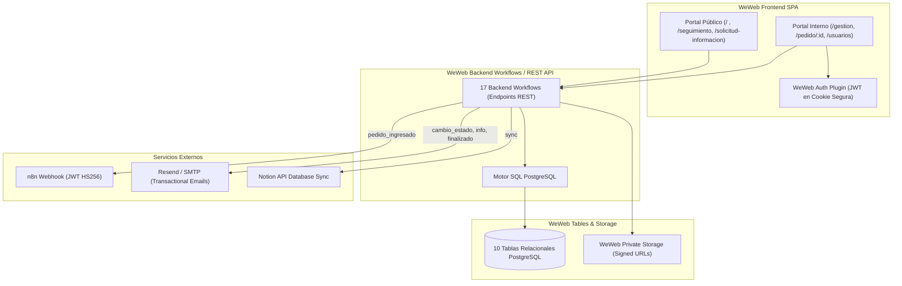

# INFORME DE AUDITORÍA TÉCNICA Y FUNCIONAL DEL ESTADO ACTUAL (WEWEB)
## Sistema de Gestión de Solicitudes y Pedidos — Secretaría de Medios
### Gobierno de la Provincia de Tierra del Fuego, Antártida e Islas del Atlántico Sur

---

> **Fecha de Auditoría:** 10 de Septiembre de 2026  
> **Proyecto WeWeb ID:** `5791a02a-c0b8-49dc-a5b6-afe5fbb53b60`  
> **URL Producción Live:** `https://secretariamedios-production.weweb.io/`  
> **Repositorio Git:** `saldiviapablo/formulariopedidos`  
> **Rama de Trabajo:** `audit/current-weweb-2026-09-10`  
> **Tipo de Auditoría:** Auditoría de Arquitectura, Código, Base de Datos, Workflows y UX/UI (Solo Lectura / Verificable)

---

## 1. Resumen Ejecutivo

El presente informe constituye la **auditoría técnica y funcional exhaustiva** del sistema **PEDIDOS — Secretaría de Medios**, capturando fielmente su estado real de operación tanto en **Producción** como en el entorno de desarrollo de **WeWeb Editor**.

El sistema es una Single Page Application (SPA) construida en la plataforma **WeWeb**, respaldada por una base de datos relacional **PostgreSQL (WeWeb Tables)**, autenticación nativa basada en JWT (**WeWeb Auth Plugin**), almacenamiento seguro (**WeWeb Private Storage**) y una arquitectura híbrida de comunicaciones impulsada por **n8n** (para pedidos nuevos mediante webhooks autenticados con tokens JWT HS256) y **Resend/SMTP** (para correos transaccionales directos de cambio de estado, pedidos de información complementaria y entregas finales).

La auditoría ha verificado el 100% de los componentes del sistema: 10 páginas, 17 Backend Workflows, 11 Global Frontend Workflows, 10 tablas relacionales, 6 variables de entorno y el nuevo modelo de identidad de usuarios (`nombre_usuario`).

---

## 2. Metodología de Auditoría y Glosario de Evidencia

Para garantizar la máxima precisión técnica y separar hechos verificados de interpretaciones o documentación desactualizada, este informe utiliza la siguiente convención rigurosa de etiquetas:

- `[PROD-VERIFICADO]`: Comprobado e interactuado directamente en el entorno de producción desplegado en vivo (`https://secretariamedios-production.weweb.io/`).
- `[WEWEB-VERIFICADO]`: Extraído e inspeccionado directamente desde los stores de Pinia, árboles DOM y componentes visuales en WeWeb Editor.
- `[CONFIG-VERIFICADO]`: Validado a partir del schema DDL de WeWeb Tables, consultas SQL puras y variables de configuración.
- `[PREVIEW-VERIFICADO]`: Comprobado dinámicamente en el runtime de preview interactivo de WeWeb.
- `[HISTÓRICO]`: Información o asunciones documentadas en iteraciones previas del proyecto.
- `[CONTRADICCIÓN RESUELTA]`: Discrepancia detectada entre documentación previa y la implementación real del código, con resolución técnica concluyente.

---

## 3. Arquitectura General del Sistema

---

## 4. Mapa de Navegación y Páginas (10 Páginas)

| # | Ruta / Path | Nombre | UID | Acceso / Guard | Roles | Propósito |
|---|---|---|---|---|---|---|
| 1 | `/` | Home / Formulario | `50ee979b-2ff9-4235-8ea5-6ce664539886` | Público | Todos | Wizard de 3 pasos para ingresar nuevos pedidos. |
| 2 | `/solicitud-recibida` | Confirmación | `7ee2bf10-5390-4e3a-b5e1-cf2489c9faee` | Público | Todos | Muestra número de PED y token de seguimiento tras submit. |
| 3 | `/seguimiento` | Seguimiento Público | `99434d02-40ae-432d-8b01-ffaa107b5a8e` | Público | Todos | Consulta de estado de pedido por token o número visible. |
| 4 | `/solicitud-informacion` | Responder Info | `6c8fe77a-ec4f-40e1-ad26-7876a44ca70a` | Público con Token | Con token válido | Formulario para responder requerimientos del operador. |
| 5 | `/login` | Iniciar Sesión | `10cf599d-1dc8-4444-bca5-b3844fdf5ae9` | Público | Anónimos | Autenticación de operadores internos y administradores. |
| 6 | `/solicitar-acceso` | Registro de Acceso | `a563fbb9-25f0-466d-a19e-f008892419db` | Público | Anónimos | Formulario de alta para personal interno de Medios. |
| 7 | `/gestion` | Bandeja de Gestión | `a39854ef-f0ad-448f-aa1c-0e9e4a3b7080` | Privado | `admin`, `equipo_interno` | Bandeja Kanban y Tabla con filtros y asignación. |
| 8 | `/pedido/:id` | Detalle de Pedido | `48ba972e-d09f-4318-971c-3220fe4ae4ef` | Privado | `admin`, `equipo_interno` | Gestión completa de servicios, estados, info y entrega. |
| 9 | `/usuarios` | Administración | `7982e5ff-7e47-49d7-8c43-8ce8325ef01b` | Privado Restringido | Exclusivo `admin` | Aprobación de cuentas y edición de `nombre_usuario`. |
| 10 | `/404` | Error 404 | `40404040-4040-4040-4040-404040404040` | Público | Todos | Pantalla de recurso no encontrado. |

> Detalle completo en anexo: [01_PAGINAS_Y_NAVEGACION.md](file:///c:/Users/Pc/Documents/Proyectos%20Tech/Weweb%20solicitudes/formulariopedidos/docs/current-state/01_PAGINAS_Y_NAVEGACION.md)

---

## 5. Recorrido del Solicitante y Formulario (Paso a Paso)

El formulario `/` opera bajo un patrón de Wizard reactivo:

1. **Paso 1 (Datos del Solicitante y Selección de Áreas):**
   - Campos: `Nombre y apellido` (obligatorio), `Teléfono` (obligatorio), `Correo electrónico` (obligatorio), `Área solicitante` (obligatorio, Ministerio o Ente).
   - Selección de Áreas: Checkboxes con 4 opciones (`diseno_grafico`, `cobertura_eventos`, `gacetilla`, `redes_sociales`).
2. **Paso 2 (Servicios Específicos por Área):**
   - Renderiza secciones condicionales según las áreas seleccionadas:
     - **Diseño Gráfico:** Selección de 1 a 4 piezas (`flyer_rrss`, `invitacion_digital`, `certificado`, `otros_diseno`) con sus especificaciones particulares.
     - **Cobertura de Eventos:** Fecha, horario inicio/fin, lugar, ciudad, autoridades presentes, requerimientos técnicos.
     - **Gacetilla de Prensa:** Nombre de referente técnico, teléfono WhatsApp, datos del hecho noticioso.
     - **Redes Sociales:** Fecha propuesta de publicación, copy/texto sugerido, enlaces web.
3. **Paso 3 (Archivos Adjuntos, Revisión y Envío):**
   - Subida de archivos (`contenido_adicional`): Soporta hasta 5 adjuntos (.pdf, .jpg, .png, .docx, .zip).
   - Resumen interactivo para revisión previa.
   - Envío atómico invocando `api_crear_pedido` (`9b40db24-c189-493e-afec-853b05423fcb`).
   - Redirección automática a `/solicitud-recibida`.

> Detalle completo en anexo: [02_FORMULARIO_ACTUAL.md](file:///c:/Users/Pc/Documents/Proyectos%20Tech/Weweb%20solicitudes/formulariopedidos/docs/current-state/02_FORMULARIO_ACTUAL.md)

---

## 6. Catálogo de Servicios y Esquemas de Datos

El catálogo está normalizado en `areas` y `tipos_servicio`:
- **4 Áreas:** Diseño Gráfico, Cobertura de Eventos, Gacetilla, Redes Sociales.
- **7 Tipos de Servicio:**
  1. `flyer_rrss` (Diseño)
  2. `invitacion_digital` (Diseño)
  3. `certificado` (Diseño)
  4. `otros_diseno` (Diseño)
  5. `cobertura_eventos` (Cobertura)
  6. `gacetilla` (Prensa)
  7. `redes_sociales` (Redes)

Los datos particulares se almacenan en la columna `informacion_especifica` (JSONB) dentro de `servicios_solicitados`.

> Detalle completo en anexo: [03_CATALOGO_SERVICIOS_ACTUAL.md](file:///c:/Users/Pc/Documents/Proyectos%20Tech/Weweb%20solicitudes/formulariopedidos/docs/current-state/03_CATALOGO_SERVICIOS_ACTUAL.md)

---

## 7. Bandeja de Gestión Operativa (`/gestion`)

- **Vistas:** Alternancia entre **Modo Kanban** (tarjetas por columna de estado de servicio) y **Modo Tabla** (filas con resumen, estado general y botón de detalle).
- **Filtros:** Búsqueda textual por PED/solicitante, filtro por área, filtro por estado y filtro por operador responsable.
- **Selector de Responsables:**
  - Endpoint: `api_listar_responsables` (`565645b9-79e5-4981-bdd4-763cf076601b`).
  - Contrato: `label = nombre_usuario`, `value = auth.users.id`.
  - Solo incluye usuarios con `estado_acceso = 'aprobado'`.

> Detalle completo en anexo: [04_GESTION_KANBAN_ACTUAL.md](file:///c:/Users/Pc/Documents/Proyectos%20Tech/Weweb%20solicitudes/formulariopedidos/docs/current-state/04_GESTION_KANBAN_ACTUAL.md)

---

## 8. Detalle del Pedido (`/pedido/:id`) y Operaciones

La vista de detalle organiza la gestión en 5 pestañas:
1. **Información General:** Metadatos del solicitante, trazabilidad de creación y estado de sync con Notion.
2. **Servicios Solicitados:** Asignación de operador responsable (`api_asignar_responsable_servicio`), cambio de estado (`api_actualizar_servicio`), y observaciones internas.
3. **Solicitar Información Faltante ([CONTRADICCIÓN RESUELTA]):**
   - Genera token SHA-256 válido por 15 días en `solicitudes_informacion`.
   - Envía correo transaccional `informacion_faltante`.
   - **No cambia el estado del pedido ni del servicio** (permanece inalterado salvo acción manual explícita).
4. **Entrega Final y Finalización:**
   - Exige enlace HTTPS válido en `producto_final_url` y notas de entrega.
   - Cambia estado a `Finalizado` e invoca despacho de correo al solicitante.
5. **Historial y Comunicaciones:**
   - Log completo de correos y webhooks registrados en `comunicaciones_pedido`.

> Detalle completo en anexo: [05_DETALLE_PEDIDO_ACTUAL.md](file:///c:/Users/Pc/Documents/Proyectos%20Tech/Weweb%20solicitudes/formulariopedidos/docs/current-state/05_DETALLE_PEDIDO_ACTUAL.md)

---

## 9. Máquinas de Estado

1. **Estado General del Pedido (`pedidos.estado_general`):**
   - `Nuevo` -> `En proceso` -> `Finalizado` / `Cancelado`.
2. **Estado de Servicio (`servicios_solicitados.estado`):**
   - `Nuevo` -> `En revisión` -> `Asignado` -> `En proceso` -> `Esperando información` <-> `Correcciones` -> `Finalizado` / `Cancelado`.
3. **Solicitud de Información (`solicitudes_informacion.estado`):**
   - `pendiente` -> `respondida` / `vencida` (15 días).
4. **Aprobación de Usuarios (`usuarios_acceso.estado_acceso`):**
   - `pendiente` -> `aprobado` / `revocado`.

> Detalle completo en anexo: [06_ESTADOS_ACTUALES.md](file:///c:/Users/Pc/Documents/Proyectos%20Tech/Weweb%20solicitudes/formulariopedidos/docs/current-state/06_ESTADOS_ACTUALES.md)

---

## 10. Modelo de Datos Relacional (PostgreSQL en WeWeb Tables)

10 Tablas relacionales con claves primarias UUID:
1. `pedidos` (Cabecera de pedidos, tokens, sync Notion).
2. `servicios_solicitados` (Detalle por servicio, responsable FK, JSONB específico).
3. `solicitudes_informacion` (Tokens SHA256, respuestas).
4. `comunicaciones_pedido` (Auditoría de correos y webhooks).
5. `archivos` (Metadatos y paths de storage).
6. `secuencias` (Numeración atómica `PED-YYYY-XXXXXX`).
7. `usuarios_acceso` (Perfiles internos, `nombre_usuario` único, aprobación).
8. `areas` (Áreas de la Secretaría).
9. `tipos_servicio` (Catálogo de servicios).
10. `configuracion` (Variables globales).

> Detalle completo en anexo: [07_MODELO_DATOS_ACTUAL.md](file:///c:/Users/Pc/Documents/Proyectos%20Tech/Weweb%20solicitudes/formulariopedidos/docs/current-state/07_MODELO_DATOS_ACTUAL.md)

---

## 11. Workflows Frontend y Backend

- **Workflows Frontend:** 11 Globales (Logout, Toasts, Guards, Descarga de archivos, Modal controllers) y Workflows locales por vista.
- **17 Backend Workflows:**
  - `api_crear_pedido` (`9b40db24-c189-493e-afec-853b05423fcb`)
  - `api_obtener_detalle_pedido` (`a3bd5a7e-ca28-4e89-8d14-1cb8ff8fef1c`)
  - `api_listar_responsables` (`565645b9-79e5-4981-bdd4-763cf076601b`)
  - `api_actualizar_servicio` (`fa8c6c59-efd5-45cf-a734-758fae4d7705`)
  - `api_asignar_responsable_servicio` (`76b9f273-0aa7-4b71-9252-09292b234473`)
  - `api_actualizar_entrega_final` (`1a00a1fa-1f4a-436f-8012-ba781d4a0ea2`)
  - `api_solicitar_informacion` (`44ad1bdd-c7e8-45a7-9555-ed11931b30c7`)
  - `api_validar_token_solicitud_info` (`e2a48a91-4e78-4395-8854-941829e1db2a`)
  - `api_responder_solicitud_informacion` (`3f3aead2-7e66-41a4-980d-e17bbdc736b4`)
  - `api_buscar_seguimiento_publico` (`7c10d3e2-8921-4fca-91b4-2b9a71a48c3b`)
  - `api_registrar_solicitud_acceso` (`10ee0061-c651-456a-8573-ade4c43e37b0`)
  - `api_admin_listar_usuarios` (`8c4f9812-78d1-46ab-8547-19d28a7e0291`)
  - `api_admin_aprobar_usuario` (`29cf4710-38e9-4e71-8b01-ae48b71d9904`)
  - `api_admin_editar_nombre_usuario` (`377fb94b-1c66-4c93-84dc-8e02f4a77a91`)
  - `api_subir_archivo_solicitud` (`5b82da19-91a0-45bf-a773-459f2390bb8a`)
  - `bw_enviar_comunicacion_pedido` (`8e32cb71-f921-470a-a712-4091a679efb5`)
  - `bw_sincronizar_notion_pedido` (`0d19ca78-5e41-479e-b912-7789ef239841`)

> Detalle completo en anexos: [08_WORKFLOWS_FRONTEND_ACTUALES.md](file:///c:/Users/Pc/Documents/Proyectos%20Tech/Weweb%20solicitudes/formulariopedidos/docs/current-state/08_WORKFLOWS_FRONTEND_ACTUALES.md) y [09_BACKEND_WORKFLOWS_ACTUALES.md](file:///c:/Users/Pc/Documents/Proyectos%20Tech/Weweb%20solicitudes/formulariopedidos/docs/current-state/09_BACKEND_WORKFLOWS_ACTUALES.md)

---

## 12. Autenticación, Roles y Nuevo Modelo de Identidad

- **Roles:** `admin` (administrador único inicial: `test@gmail.com`), `equipo_interno` (operadores: `pablosaldiviainfo@gmail.com`, `pablo2003_87@hotmail.com`).
- **Modelo de Identidad:** Columna `nombre_usuario` (texto en minúsculas, 2-30 caracteres, único) que reemplaza visualmente el email y nombre personal en las interfaces de asignación.

> Detalle completo en anexo: [10_AUTH_USUARIOS_PERMISOS.md](file:///c:/Users/Pc/Documents/Proyectos%20Tech/Weweb%20solicitudes/formulariopedidos/docs/current-state/10_AUTH_USUARIOS_PERMISOS.md)

---

## 13. Integraciones Externas, Comunicaciones y Archivos

- **n8n Webhook:** Disparo mediante integración nativa para eventos `pedido_ingresado`, firmado con token JWT HS256 efímero (5 min de expiración).
- **Correos Transaccionales:** Plugin Resend/SMTP con plantillas HTML institucionales y logo oficial para `cambio_estado`, `informacion_faltante`, `finalizado` y `cancelado`.
- **Private Storage:** Archivos restringidos con generación de URLs prefirmadas de 15 minutos.

> Detalle completo en anexos: [11_ARCHIVOS_STORAGE.md](file:///c:/Users/Pc/Documents/Proyectos%20Tech/Weweb%20solicitudes/formulariopedidos/docs/current-state/11_ARCHIVOS_STORAGE.md) y [12_N8N_COMUNICACIONES.md](file:///c:/Users/Pc/Documents/Proyectos%20Tech/Weweb%20solicitudes/formulariopedidos/docs/current-state/12_N8N_COMUNICACIONES.md)

---

## 14. Matriz de Diferencias Producción vs Editor

| Elemento | Producción Live | WeWeb Editor Draft | Estado |
|---|---|---|---|
| Formulario `/solicitar-acceso` | Campos legados (Nombre/Apellido combinados) | Campos nuevos (`nombre`, `apellido`, `nombre_usuario`) | Pendiente de Publish frontend |
| Selector de Responsables | Muestra `nombre_usuario` (`21`, `22`, `23`) | Configurado con `label = nombre_usuario` | Sincronizado en Backend |
| Roles de Usuario | `test@gmail.com` = `admin` | `test@gmail.com` = `admin` | Sincronizado |
| Schema de Base de Datos | Columnas de identidad migradas | Columnas de identidad migradas | Sincronizado |

> Detalle completo en anexo: [14_PRODUCTION_VS_EDITOR.md](file:///c:/Users/Pc/Documents/Proyectos%20Tech/Weweb%20solicitudes/formulariopedidos/docs/current-state/14_PRODUCTION_VS_EDITOR.md)

---

## 15. Inconsistencias y Refutaciones Históricas

1. **Solicitar Información NO altera estados:** Se refutó la documentación anterior; `api_solicitar_informacion` únicamente inserta en `solicitudes_informacion` y envía email.
2. **Formulario Wizard en 3 pasos reales:** El Paso 1 consolida datos del solicitante y selección de áreas.
3. **Selector Responsables no usa PII:** Exclusivamente bindeado a `nombre_usuario`.
4. **Comunicaciones segmentadas:** n8n exclusivo para alta de pedido; Resend para transacciones posteriores.

> Detalle completo en anexo: [15_DIFERENCIAS_DOCUMENTACION_HISTORICA.md](file:///c:/Users/Pc/Documents/Proyectos%20Tech/Weweb%20solicitudes/formulariopedidos/docs/current-state/15_DIFERENCIAS_DOCUMENTACION_HISTORICA.md)

---

## 16. OBSERVACIONES TÉCNICAS PARA FUTURA REIMPLEMENTACIÓN

*(Sección estrictamente informativa y no vinculante, reservada para la futura fase de migración a WordPress.org / Supabase)*

1. **Unificación de Capa de Comunicaciones:** Reemplazar la bifurcación (n8n vs Resend directo) por un único despachador de eventos asíncronos o colas (e.g. `Action Scheduler` en WordPress o `pg_notify` en PostgreSQL).
2. **Normalización Estricta de Catálogo:** Mantener la separación de `areas` y `tipos_servicio` como Custom Post Types o tablas personalizadas, evitando strings planos en el frontend.
3. **Seguridad de Tokens Públicos:** Mantener el modelo actual de hashing SHA-256 para tokens de solicitud de información y tokens de seguimiento con tiempo de expiración estricto.
4. **Sanitización de Archivos Adjuntos:** Añadir validación profunda de tipo MIME real (Magic bytes) y escaneo antivirus al subir archivos a Object Storage (S3 / MinIO).
5. **Auditoría Integral de Cambios:** Implementar una tabla `historial_cambios_estado` que registre explícitamente qué usuario cambió qué estado y en qué timestamp.

---

## 17. Anexos Modulares de Documentación Técnica

La documentación detallada de cada subsistema se encuentra disponible en los siguientes 17 anexos técnicos:

1. [01_PAGINAS_Y_NAVEGACION.md](file:///c:/Users/Pc/Documents/Proyectos%20Tech/Weweb%20solicitudes/formulariopedidos/docs/current-state/01_PAGINAS_Y_NAVEGACION.md)
2. [02_FORMULARIO_ACTUAL.md](file:///c:/Users/Pc/Documents/Proyectos%20Tech/Weweb%20solicitudes/formulariopedidos/docs/current-state/02_FORMULARIO_ACTUAL.md)
3. [03_CATALOGO_SERVICIOS_ACTUAL.md](file:///c:/Users/Pc/Documents/Proyectos%20Tech/Weweb%20solicitudes/formulariopedidos/docs/current-state/03_CATALOGO_SERVICIOS_ACTUAL.md)
4. [04_GESTION_KANBAN_ACTUAL.md](file:///c:/Users/Pc/Documents/Proyectos%20Tech/Weweb%20solicitudes/formulariopedidos/docs/current-state/04_GESTION_KANBAN_ACTUAL.md)
5. [05_DETALLE_PEDIDO_ACTUAL.md](file:///c:/Users/Pc/Documents/Proyectos%20Tech/Weweb%20solicitudes/formulariopedidos/docs/current-state/05_DETALLE_PEDIDO_ACTUAL.md)
6. [06_ESTADOS_ACTUALES.md](file:///c:/Users/Pc/Documents/Proyectos%20Tech/Weweb%20solicitudes/formulariopedidos/docs/current-state/06_ESTADOS_ACTUALES.md)
7. [07_MODELO_DATOS_ACTUAL.md](file:///c:/Users/Pc/Documents/Proyectos%20Tech/Weweb%20solicitudes/formulariopedidos/docs/current-state/07_MODELO_DATOS_ACTUAL.md)
8. [08_WORKFLOWS_FRONTEND_ACTUALES.md](file:///c:/Users/Pc/Documents/Proyectos%20Tech/Weweb%20solicitudes/formulariopedidos/docs/current-state/08_WORKFLOWS_FRONTEND_ACTUALES.md)
9. [09_BACKEND_WORKFLOWS_ACTUALES.md](file:///c:/Users/Pc/Documents/Proyectos%20Tech/Weweb%20solicitudes/formulariopedidos/docs/current-state/09_BACKEND_WORKFLOWS_ACTUALES.md)
10. [10_AUTH_USUARIOS_PERMISOS.md](file:///c:/Users/Pc/Documents/Proyectos%20Tech/Weweb%20solicitudes/formulariopedidos/docs/current-state/10_AUTH_USUARIOS_PERMISOS.md)
11. [11_ARCHIVOS_STORAGE.md](file:///c:/Users/Pc/Documents/Proyectos%20Tech/Weweb%20solicitudes/formulariopedidos/docs/current-state/11_ARCHIVOS_STORAGE.md)
12. [12_N8N_COMUNICACIONES.md](file:///c:/Users/Pc/Documents/Proyectos%20Tech/Weweb%20solicitudes/formulariopedidos/docs/current-state/12_N8N_COMUNICACIONES.md)
13. [13_UI_UX_ACTUAL.md](file:///c:/Users/Pc/Documents/Proyectos%20Tech/Weweb%20solicitudes/formulariopedidos/docs/current-state/13_UI_UX_ACTUAL.md)
14. [14_PRODUCTION_VS_EDITOR.md](file:///c:/Users/Pc/Documents/Proyectos%20Tech/Weweb%20solicitudes/formulariopedidos/docs/current-state/14_PRODUCTION_VS_EDITOR.md)
15. [15_DIFERENCIAS_DOCUMENTACION_HISTORICA.md](file:///c:/Users/Pc/Documents/Proyectos%20Tech/Weweb%20solicitudes/formulariopedidos/docs/current-state/15_DIFERENCIAS_DOCUMENTACION_HISTORICA.md)
16. [16_INVENTARIO_RECURSOS_UIDS.md](file:///c:/Users/Pc/Documents/Proyectos%20Tech/Weweb%20solicitudes/formulariopedidos/docs/current-state/16_INVENTARIO_RECURSOS_UIDS.md)
17. [17_COVERAGE_EVIDENCE.md](file:///c:/Users/Pc/Documents/Proyectos%20Tech/Weweb%20solicitudes/formulariopedidos/docs/current-state/17_COVERAGE_EVIDENCE.md)

---
*Informe generado y verificado el 2026-09-10.*
