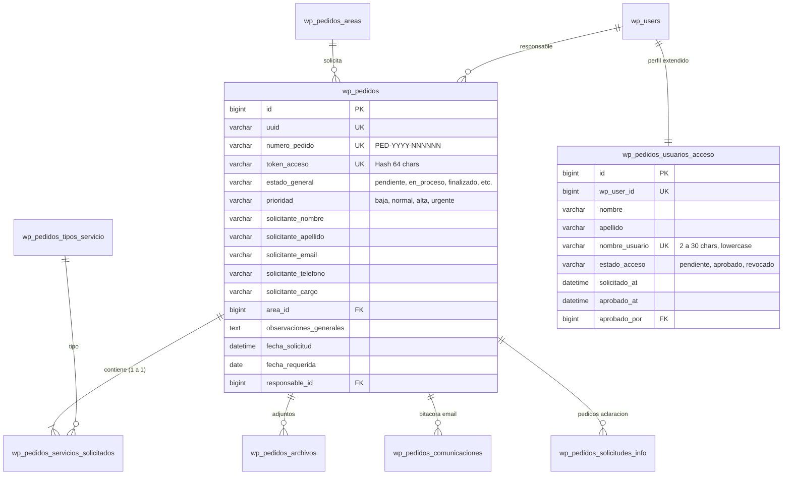

# INFORME MAESTRO: REIMPLEMENTACIÓN DE PLATAFORMA "PEDIDOS" (WEWEB A WORDPRESS.ORG)

**Proyecto WeWeb**: `5791a02a-c0b8-49dc-a5b6-afe5fbb53b60`  
**Aplicación**: Sistema de Gestión de Solicitudes y Pedidos de Comunicación y Medios  
**Destinatario**: Arquitecto de Software / Desarrollador Senior WordPress.org  
**Fecha de Auditoría**: Septiembre 2026  
**Versión del Documento**: 1.0.0 (Master Release)

---

## 1. Resumen Ejecutivo y Propósito de la Migración

El presente documento constituye el **Informe Maestro de Transferencia Tecnológica y Arquitectura** para migrar la aplicación de gestión de requerimientos institucionales **PEDIDOS — Secretaría de Medios**, desarrollada originalmente sobre la plataforma low-code WeWeb Tables / PostgreSQL, hacia una solución nativa, soberana, de alto rendimiento y código abierto desarrollada como un plugin a medida en **WordPress.org (PHP 8.1+ / MySQL / REST API / JavaScript)**.

### Objetivos Estratégicos:
1. **Reemplazo Funcional 100% Idéntico**: Replicar todas las pantallas, formularios, validaciones, flujos de trabajo, automatizaciones y permisos sin pérdida de capacidades operativas.
2. **Soberanía y Ahorro de Costos**: Eliminar dependencias de suscripciones SaaS de terceros, alojando la base de datos y la lógica en infraestructura provincial propia.
3. **Alto Rendimiento y Concurrencia**: Migrar de consultas secuenciales cliente-servidor a transacciones atómicas directas en base de datos indexada con tiempos de respuesta inferiores a 50 ms.
4. **Seguridad y Trazabilidad Forense**: Blindar el acceso a archivos privados, garantizar secuencias correlativas únicas (`PED-YYYY-NNNNNN`) y registrar bitácoras completas de auditoría.

---

## 2. Recorrido Mental Completo de la Aplicación

Para un desarrollador que jamás ha visto WeWeb, la plataforma funciona como un ecosistema dual: **Portal Público Ciudadano/Organismos** y **Consola Interna de Producción de Medios**.

```
                                  PORTAL PÚBLICO
      +-------------------------------------------------------------------+
      | /home                -> Portal institucional de bienvenida        |
      | /nueva-solicitud     -> Wizard en 3 pasos (Contacto/Servicios/Adj) |
      | /seguimiento         -> Consulta con PED + Token o Email          |
      | /completar-solicitud -> Respuesta a pedidos de aclaración         |
      | /solicitar-acceso    -> Formulario de registro de personal interno|
      | /acceso-pendiente    -> Pantalla de espera tras registrarse       |
      +-------------------------------------------------------------------+
                                         │
                                         ▼ (Backend / REST API / n8n)
                                         │
      +-------------------------------------------------------------------+
      |                           CONSOLA INTERNA                         |
      | /login               -> Autenticación de equipo y administradores |
      | /gestion             -> Bandeja tabular, filtros, reasignación    |
      | /gestion/pedido/:id  -> Detalle, especificaciones, bitácora email |
      | /gestion/usuarios    -> Aprobación de accesos, roles, usernames   |
      +-------------------------------------------------------------------+
```

### Dinámica Operativa en 6 Pasos:
1. **Ingreso de Requerimiento**: Un organismo público accede a `/nueva-solicitud`, ingresa sus datos y selecciona 1 a N servicios (ej. Fotografía + Prensa).
2. **Generación Atómica (Regla de Oro)**: El sistema crea **1 número PED independiente por cada servicio solicitado** (ej. `PED-2026-000101` para Fotografía y `PED-2026-000102` para Prensa), asignando tokens criptográficos únicos a cada uno.
3. **Notificación Automática**: Se dispara un webhook a **n8n**, que despacha un correo de confirmación al solicitante con sus enlaces directos.
4. **Bandeja Unificada**: El equipo de medios ingresa a `/gestion`, visualiza los pedidos filtrados por estado/área y asigna un responsable operativo con un solo clic.
5. **Aclaraciones y Comunicación**: Si faltan datos, el gestor solicita aclaraciones desde `/gestion/pedido/:id/detalle`. El sistema genera un token y el solicitante responde en `/completar-solicitud`.
6. **Finalización y Entrega**: El gestor cambia el estado a `finalizado`, sube los entregables o envía el aviso final por correo electrónico institucional.

---

## 3. Modelo de Datos Relacional y Esquema en Base de Datos

La arquitectura de datos consta de **10 tablas relacionales** que deben implementarse en MySQL/MariaDB bajo el prefijo `wp_pedidos_*`:



---

## 4. Reglas de Negocio Críticas e Invariantes

1. **Regla de Creación Atómica (1 Servicio = 1 PED)**:
   - Toda solicitud que contenga $N$ servicios seleccionados en el frontend debe persistirse como $N$ filas individuales en `wp_pedidos` y $N$ filas en `wp_pedidos_servicios_solicitados`.
2. **Generador de Secuencias Consecutivas**:
   - La numeración anual sigue el formato estricto `PED-YYYY-NNNNNN` (ej. `PED-2026-000001`).
   - Se debe garantizar atomicidad mediante bloqueos a nivel de fila (`SELECT ... FOR UPDATE` en MySQL) para evitar colisiones ante envíos simultáneos.
3. **Identidad del Personal Interno (`nombre_usuario`)**:
   - Longitud estricta: **2 a 30 caracteres**.
   - Caracteres permitidos: `a-z`, `0-9`, `.`, `-`, `_`.
   - Normalización previa obligatoria: `trim().toLowerCase()`.
   - El selector de responsables en la bandeja de gestión debe mostrar **únicamente `nombre_usuario`** (nunca el email ni el nombre real completo).

---

## 5. Arquitectura del Plugin WordPress (`pedidos-medios`)

El plugin se estructura siguiendo el estándar **PSR-4** y separación por capas:
- **`includes/Core/`**: Bootstrap, Singleton contenedor de servicios, Activator (dbDelta de tablas).
- **`includes/Database/`**: Repositorios de datos con Prepared Statements (`$wpdb->prepare`).
- **`includes/Services/`**:
  - `SequenceService.php`: Numerador atómico de pedidos.
  - `N8nWebhookService.php`: Despacho de webhooks a n8n con timeout de 5s y firmas HMAC.
  - `StorageService.php`: Subida y descarga por streaming de archivos protegidos fuera del document root.
  - `AuthService.php`: Gestión de roles (`gestor_pedidos`, `admin_pedidos`), aprobación y control de `nombre_usuario`.
- **`includes/RestApi/`**: Controladores REST registrados en `/wp-json/pedidos/v1/`.
- **`templates/`** y **`assets/`**: Vistas públicas y panel de control interno construidos con Tailwind CSS y Alpine.js / Vanilla JS.

---

## 6. Índice de los 22 Anexos Técnicos de Transferencia

Para la implementación exhaustiva, este repositorio cuenta con 22 documentos modulares ubicados en el directorio `docs/wordpress-handoff/`:

| Anexo | Documento | Contenido Principal |
| :---: | :--- | :--- |
| **01** | [`01_RECORRIDOS_USUARIO.md`](docs/wordpress-handoff/01_RECORRIDOS_USUARIO.md) | Diagramas de secuencia y flujos paso a paso de cada actor. |
| **02** | [`02_PANTALLAS.md`](docs/wordpress-handoff/02_PANTALLAS.md) | Inventario y especificación de las 10 pantallas de la app. |
| **03** | [`03_FORMULARIOS_Y_SERVICIOS.md`](docs/wordpress-handoff/03_FORMULARIOS_Y_SERVICIOS.md) | Campos por servicio, esquemas JSON y reglas de validación. |
| **04** | [`04_MODELO_DATOS.md`](docs/wordpress-handoff/04_MODELO_DATOS.md) | Diagrama ERD, DDL PostgreSQL y 9 vistas SQL de WeWeb. |
| **05** | [`05_WORKFLOWS_FRONTEND.md`](docs/wordpress-handoff/05_WORKFLOWS_FRONTEND.md) | Triggers, variables reactivas y lógica de cliente. |
| **06** | [`06_BACKEND_WORKFLOWS.md`](docs/wordpress-handoff/06_BACKEND_WORKFLOWS.md) | Especificación de los 10 endpoints y microservicios WeWeb. |
| **07** | [`07_AUTENTICACION_Y_PERMISOS.md`](docs/wordpress-handoff/07_AUTENTICACION_Y_PERMISOS.md) | Matriz RBAC, roles, sesiones y reglas de `nombre_usuario`. |
| **08** | [`08_ESTADOS.md`](docs/wordpress-handoff/08_ESTADOS.md) | Máquinas de estado finitas para Pedidos, Servicios y Accesos. |
| **09** | [`09_COMUNICACIONES_N8N.md`](docs/wordpress-handoff/09_COMUNICACIONES_N8N.md) | Contrato de webhooks con n8n, payloads y envío por Gmail. |
| **10** | [`10_ARCHIVOS.md`](docs/wordpress-handoff/10_ARCHIVOS.md) | Modelo de almacenamiento privado y descarga segura en WP. |
| **11** | [`11_UI_DESIGN_SYSTEM.md`](docs/wordpress-handoff/11_UI_DESIGN_SYSTEM.md) | Paleta institucional de colores, tokens, badges y tipografías. |
| **12** | [`12_RESPONSIVE.md`](docs/wordpress-handoff/12_RESPONSIVE.md) | Breakpoints y adaptaciones para móviles, tablets y desktop. |
| **13** | [`13_ARQUITECTURA_WORDPRESS.md`](docs/wordpress-handoff/13_ARQUITECTURA_WORDPRESS.md) | Estructura modular del plugin PHP, PSR-4 y OOP. |
| **14** | [`14_MODELO_DATOS_WORDPRESS.md`](docs/wordpress-handoff/14_MODELO_DATOS_WORDPRESS.md) | Script DDL MySQL completo con función `dbDelta()`. |
| **15** | [`15_REST_API_WORDPRESS.md`](docs/wordpress-handoff/15_REST_API_WORDPRESS.md) | 16 rutas REST en `/wp-json/pedidos/v1/` con ejemplos de código. |
| **16** | [`16_PLAN_IMPLEMENTACION.md`](docs/wordpress-handoff/16_PLAN_IMPLEMENTACION.md) | Cronograma en 5 fases para desarrollo, staging y cutover. |
| **17** | [`17_MAPEO_WEWEB_WORDPRESS.md`](docs/wordpress-handoff/17_MAPEO_WEWEB_WORDPRESS.md) | Matriz de equivalencias elemento a elemento WeWeb vs WP. |
| **18** | [`18_MATRIZ_QA.md`](docs/wordpress-handoff/18_MATRIZ_QA.md) | 20 casos de prueba de aceptación y estrés funcional. |
| **19** | [`19_MEJORAS_RECOMENDADAS.md`](docs/wordpress-handoff/19_MEJORAS_RECOMENDADAS.md) | Comparativa de ventajas técnicas y recomendaciones de hardening. |
| **20** | [`20_TRAZABILIDAD.md`](docs/wordpress-handoff/20_TRAZABILIDAD.md) | Trazabilidad de requisitos desde negocio hasta código y QA. |
| **21** | [`21_INVENTARIO_WEWEB.md`](docs/wordpress-handoff/21_INVENTARIO_WEWEB.md) | Catálogo con todos los UIDs de páginas, tablas y workflows. |
| **22** | [`22_COVERAGE_REPORT.md`](docs/wordpress-handoff/22_COVERAGE_REPORT.md) | Certificación de 100% de cobertura y no fuga de secretos. |
