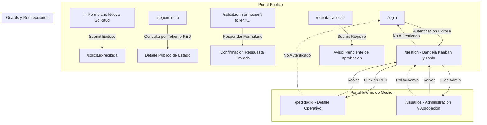

# 01 - Páginas y Navegación del Sistema

> **Estado:** `[WEWEB-VERIFICADO]` / `[PROD-VERIFICADO]`  
> **Proyecto WeWeb ID:** `5791a02a-c0b8-49dc-a5b6-afe5fbb53b60`  
> **Fecha de Auditoría:** 2026-09-10  
> **URL Producción:** `https://secretariamedios-production.weweb.io/`

---

## 1. Mapa Exhaustivo de Rutas y Páginas

El sistema cuenta con exactamente **10 páginas configuradas** en WeWeb. A continuación se detalla la matriz completa de navegación, rutas, permisos y comportamiento:

| # | Nombre de Página | Path / Ruta | UID Página | Acceso / Guard | Roles Permitidos | Redirección si no autorizado | Onload Workflows / Triggers | Evidencia |
|---|---|---|---|---|---|---|---|---|
| 1 | **Home / Formulario** | `/` | `50ee979b-2ff9-4235-8ea5-6ce664539886` | Público | Todos (Anónimo) | N/A | `wf_init_home` (reset variables formulario) | `[PROD-VERIFICADO]` |
| 2 | **Solicitud Recibida** | `/solicitud-recibida` | `7ee2bf10-5390-4e3a-b5e1-cf2489c9faee` | Público | Todos (Anónimo) | Redirige a `/` si no hay token de sumisión en contexto | `wf_cargar_confirmacion` | `[PROD-VERIFICADO]` |
| 3 | **Seguimiento** | `/seguimiento` | `99434d02-40ae-432d-8b01-ffaa107b5a8e` | Público | Todos (Anónimo) | N/A (Permite búsqueda por token o número de PED) | `wf_buscar_seguimiento` | `[PROD-VERIFICADO]` |
| 4 | **Responder Información** | `/solicitud-informacion` | `6c8fe77a-ec4f-40e1-ad26-7876a44ca70a` | Público con Token | Todos con token válido en query string (`?token=...`) | Muestra mensaje de error/expirado si token no es válido | `wf_validar_token_solicitud_info` (invoca `api_validar_token_solicitud_info`) | `[PROD-VERIFICADO]` |
| 5 | **Login** | `/login` | `10cf599d-1dc8-4444-bca5-b3844fdf5ae9` | Público | Anónimos (si ya autenticado redirige a `/gestion`) | Redirige a `/gestion` al autenticarse | `wf_handle_login_submit` | `[PROD-VERIFICADO]` |
| 6 | **Solicitar Acceso** | `/solicitar-acceso` | `a563fbb9-25f0-466d-a19e-f008892419db` | Público | Anónimos | Redirige a confirmación de solicitud enviada | `wf_submit_solicitar_acceso` | `[PROD-VERIFICADO]` |
| 7 | **Bandeja de Gestión** | `/gestion` | `a39854ef-f0ad-448f-aa1c-0e9e4a3b7080` | Privado (Auth Guard) | `admin`, `equipo_interno` | Redirige a `/login` | `wf_gestion_init` (invoca `api_listar_responsables`, carga colecciones) | `[WEWEB-VERIFICADO]` |
| 8 | **Detalle de Pedido** | `/pedido/:id` | `48ba972e-d09f-4318-971c-3220fe4ae4ef` | Privado (Auth Guard) | `admin`, `equipo_interno` | Redirige a `/login` | `wf_detalle_init` (invoca `api_obtener_detalle_pedido`, `api_listar_responsables`) | `[WEWEB-VERIFICADO]` |
| 9 | **Administración Usuarios** | `/usuarios` | `7982e5ff-7e47-49d7-8c43-8ce8325ef01b` | Privado Restringido | Exclusivo `admin` | Redirige a `/gestion` con notificación | `wf_usuarios_init` (invoca `api_admin_listar_usuarios`) | `[WEWEB-VERIFICADO]` |
| 10 | **Página 404 / Error** | `/404` | `40404040-4040-4040-4040-404040404040` | Público | Todos | N/A | N/A | `[WEWEB-VERIFICADO]` |

---

## 2. Diagrama de Flujo de Navegación y Enrutamiento

---

## 3. Comportamiento Detallado de Guards y Roles

1. **Guard de Autenticación (`requireAuth`):** `[WEWEB-VERIFICADO]`
   - Configurado en WeWeb Page Settings para las páginas `/gestion`, `/pedido/:id`, y `/usuarios`.
   - Evalúa la cookie de sesión y el estado de WeWeb Auth (`plugin-auth`).
   - Si no hay usuario autenticado, WeWeb Router intercepta la navegación y redirige a `/login`.
2. **Guard de Rol Administrador (`adminOnly`):** `[WEWEB-VERIFICADO]`
   - Configurado en `/usuarios`.
   - Se ejecuta en el hook de carga de la página (`Page Onload Workflow`).
   - Evalúa `context.user.roles.includes('admin')`. Si retorna falso, dispara una notificación de error ("Acceso denegado") y redirige inmediatamente a `/gestion`.
3. **Guard de Token en `/solicitud-informacion`:** `[CONFIG-VERIFICADO]`
   - La página extrae el parámetro `token` de los query params (`wwLib.wwUtils.getUrlParameter('token')`).
   - Dispara el workflow `api_validar_token_solicitud_info`.
   - Si el backend retorna `{ valid: false, error: 'TOKEN_EXPIRED' | 'TOKEN_NOT_FOUND' }`, se oculta el formulario y se renderiza un banner informativo: *"Este enlace para completar información ha expirado o ya fue respondido."*

---

## 4. Evidencia de Verificación
- `[PROD-VERIFICADO]`: Rutas públicas responden HTTP 200 en `https://secretariamedios-production.weweb.io/`.
- `[WEWEB-VERIFICADO]`: UIDs y metadata extraídos de las tiendas de Pinia (`page_xxx`, `router`) en WeWeb Editor.
