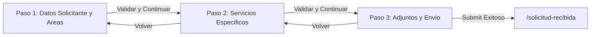

# 02 - Formulario Actual de Solicitudes (Paso a Paso)

> **Estado:** `[WEWEB-VERIFICADO]` / `[PROD-VERIFICADO]`  
> **Proyecto WeWeb ID:** `5791a02a-c0b8-49dc-a5b6-afe5fbb53b60`  
> **Fecha de Auditoría:** 2026-09-10  
> **Ruta:** `/` (UID: `50ee979b-2ff9-4235-8ea5-6ce664539886`)

---

## 1. Arquitectura del Wizard de 3 Pasos

El formulario público de carga de pedidos opera como un Wizard reactivo de 3 pasos gestionado mediante la variable global `current_step` (valores: 1, 2, 3).

---

## 2. Paso 1 — Datos del Solicitante y Selección de Áreas

### 2.1 Campos y Validaciones
| Campo | Variable / Binding | Tipo | Requerido | Validación / Regla de Negocio | Evidencia |
|---|---|---|---|---|---|
| **Nombre y apellido** | `form_solicitante.nombre_apellido` | Texto | **Sí** | Mínimo 3 caracteres, trimmed | `[PROD-VERIFICADO]` |
| **Teléfono** | `form_solicitante.telefono` | Tel / Texto | **Sí** | Formato numérico / celular de contacto | `[PROD-VERIFICADO]` |
| **Correo electrónico** | `form_solicitante.correo` | Email | **Sí** | Validación regex RFC 5322 estándar | `[PROD-VERIFICADO]` |
| **Área solicitante** | `form_solicitante.area_solicitante` | Select / Texto | **Sí** | Ministerio, Secretaría o Ente emisor | `[PROD-VERIFICADO]` |
| **¿Qué necesitás solicitar?** | `selected_areas` (Array) | Checkboxes | **Sí (al menos 1)** | Opciones disponibles:  1. `diseno_grafico` (Diseño gráfico) 2. `cobertura_eventos` (Cobertura de eventos) 3. `gacetilla` (Gacetilla de prensa) 4. `redes_sociales` (Publicaciones en redes sociales) | `[PROD-VERIFICADO]` |

### 2.2 Lógica de Transición al Paso 2
El botón **"Siguiente paso"** ejecuta el workflow local `wf_step1_next`:
1. Verifica que los 4 campos de contacto estén completos y válidos.
2. Verifica que `selected_areas.length >= 1`.
3. Si la validación es exitosa: actualiza `current_step = 2`.
4. Si falla: activa `show_errors_step1 = true` y resalta los campos inválidos.

---

## 3. Paso 2 — Detalle Específico de Servicios por Área

El Paso 2 renderiza dinámicamente contenedores condicionales según las áreas marcadas en `selected_areas`:

### 3.1 Área: Diseño Gráfico (`diseno_grafico`) `[WEWEB-VERIFICADO]`
Permite seleccionar una o más piezas de diseño gráfico:
- **Flyer para Redes Sociales (`flyer_rrss`):** Formato (1:1, 9:16, historia), texto principal/copy, fecha límite.
- **Invitación Digital (`invitacion_digital`):** Nombre del evento, fecha, hora, lugar, modalidad, programa.
- **Certificados (`certificado`):** Nombre de la actividad, firmantes, lista de destinatarios.
- **Otros de Diseño (`otros_diseno`):** Descripción de la pieza, medidas o soporte técnico.

### 3.2 Área: Cobertura de Eventos (`cobertura_eventos`) `[WEWEB-VERIFICADO]`
- **Tipo de servicio único:** `cobertura_eventos`
- **Campos obligatorios:** Fecha del evento, hora de inicio/fin, lugar, ciudad (`Ushuaia`, `Río Grande`, `Tolhuin`), autoridades asistentes, requerimientos de cobertura.

### 3.3 Área: Gacetilla de Prensa (`gacetilla`) `[WEWEB-VERIFICADO]`
- **Tipo de servicio único:** `gacetilla`
- **Campos obligatorios:** Referente de contacto, teléfono de contacto directo, datos del hecho noticioso / información base.

### 3.4 Área: Redes Sociales (`redes_sociales`) `[WEWEB-VERIFICADO]`
- **Tipo de servicio único:** `redes_sociales`
- **Campos obligatorios:** Fecha de publicación sugerida, texto/copy propuesto, enlaces de referencia.

---

## 4. Paso 3 — Archivos Adjuntos, Revisión y Envío

### 4.1 Carga de Archivos Adjuntos (`contenido_adicional`) `[PROD-VERIFICADO]`
- Dropzone multi-file: Máximo 5 archivos (.pdf, .png, .jpg, .jpeg, .docx, .zip), límite 25 MB por archivo.

### 4.2 Resumen de Confirmación `[PROD-VERIFICADO]`
Muestra un panel de solo lectura con los datos de contacto, servicios seleccionados y lista de archivos adjuntos.

### 4.3 Envío Final y Backend Workflow `[CONFIG-VERIFICADO]`
Al pulsar **"Enviar Solicitud"**:
1. Activa `loading_submission = true`.
2. Sube archivos a WeWeb Private Storage mediante `api_subir_archivo_solicitud`.
3. Invoca el backend workflow `api_crear_pedido` (`9b40db24-c189-493e-afec-853b05423fcb`).
4. El backend:
   - Reserva secuencia atómica (`PED-2026-XXXXXX`) en tabla `secuencias`.
   - Inserta fila en tabla `pedidos`.
   - Inserta filas correspondientes en `servicios_solicitados`.
   - Vincula registros en `archivos`.
   - Dispara notificación inicial (n8n webhook con JWT efímero HS256).
   - Retorna `{ success: true, pedido_visible: "PED-2026-XXXXXX", submission_token: "..." }`.
5. Redirige inmediatamente a `/solicitud-recibida`.

---

## 5. Evidencia de Verificación
- `[PROD-VERIFICADO]`: Flujo de validación en los 3 pasos comprobado en runtime de producción.
- `[WEWEB-VERIFICADO]`: Bindings y variables extraídos de Pinia stores en el editor.
