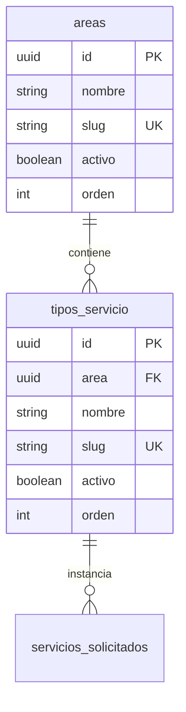

# 03 - Catálogo de Servicios Actual y Esquema de Datos Específicos

> **Estado:** `[WEWEB-VERIFICADO]` / `[CONFIG-VERIFICADO]`  
> **Proyecto WeWeb ID:** `5791a02a-c0b8-49dc-a5b6-afe5fbb53b60`  
> **Fecha de Auditoría:** 2026-09-10

---

## 1. Estructura Jerárquica: Áreas vs Tipos de Servicio

En la base de datos de WeWeb Tables, el catálogo está normalizado en dos tablas relacionales:
1. `areas` (Categorías principales de la Secretaría de Medios).
2. `tipos_servicio` (Servicios concretos solicitables, asociados a un área por Foreign Key).



---

## 2. Matriz Completa del Catálogo

| Área (Slug) | Nombre de Área | Tipo de Servicio (Slug) | Nombre del Servicio | Requiere Info Específica | Permite Adjuntos |
|---|---|---|---|---|---|
| `diseno_grafico` | Diseño gráfico | `flyer_rrss` | Flyer para Redes Sociales | Sí (Formato, texto, fecha límite) | Sí |
| `diseno_grafico` | Diseño gráfico | `invitacion_digital` | Invitación Digital | Sí (Evento, fecha, lugar, programa) | Sí |
| `diseno_grafico` | Diseño gráfico | `certificado` | Certificados | Sí (Capacitación, firmantes, lista) | Sí |
| `diseno_grafico` | Diseño gráfico | `otros_diseno` | Otros Requerimientos Gráficos | Sí (Descripción libre, medidas) | Sí |
| `cobertura_eventos` | Cobertura de eventos | `cobertura_eventos` | Cobertura Integral de Eventos | Sí (Fecha, horario, lugar, autoridades) | No (Solo en confirmación) |
| `gacetilla` | Gacetilla | `gacetilla` | Redacción de Gacetilla de Prensa | Sí (Contacto prensa, teléfono, info base) | Sí |
| `redes_sociales` | Redes sociales | `redes_sociales` | Publicación en Redes Oficiales | Sí (Fecha sugerida, copy, links) | Sí |

---

## 3. Esquemas JSON de `informacion_especifica` por Servicio

Cada fila en la tabla `servicios_solicitados` persiste los datos dinámicos en una columna de tipo `JSONB` denominada `informacion_especifica`. A continuación se especifican las estructuras JSON reales:

### 3.1 `flyer_rrss`
```json
{
  "formato": "1:1 | 9:16 | historia",
  "texto_flyer": "Texto principal y títulos que deben figurar en la pieza",
  "fecha_limite": "2026-09-20",
  "observaciones": "Comentarios adicionales de estilo o paleta"
}
```

### 3.2 `invitacion_digital`
```json
{
  "nombre_evento": "Acto Oficial de Apertura",
  "fecha_evento": "2026-09-25",
  "hora_evento": "11:00",
  "lugar_evento": "Salón de Actos de Casa de Gobierno",
  "modalidad": "presencial | virtual | hibrida",
  "programa": "Cronograma detallado del evento"
}
```

### 3.3 `certificado`
```json
{
  "nombre_capacitacion": "Taller de Comunicación Pública",
  "firmantes": "Ministro de Gobierno, Secretaria de Medios",
  "cantidad_destinatarios": 45,
  "formato_entrega": "digital_individual | digital_imprimible"
}
```

### 3.4 `otros_diseno`
```json
{
  "descripcion_pieza": "Diseño de cartel para marquesina institucional",
  "medidas_soporte": "200cm x 80cm",
  "referencias_visuales": "Seguir manual de marca 2026"
}
```

### 3.5 `cobertura_eventos`
```json
{
  "fecha_evento": "2026-09-18",
  "hora_inicio": "09:30",
  "hora_fin": "12:00",
  "lugar": "Centro Cultural Yaganes",
  "ciudad": "Rio Grande | Ushuaia | Tolhuin",
  "autoridades": "Gobernador, Ministros provinciales",
  "servicios_requeridos": ["fotografia", "video", "prensa_en_vivo"]
}
```

### 3.6 `gacetilla`
```json
{
  "contacto_nombre": "Lic. Mariana Lopez",
  "contacto_telefono": "+5492901556677",
  "datos_noticia": "Anuncio de nuevas líneas de financiamiento productivo...",
  "ejes_discurso": "Puntos clave y citas textuales sugeridas"
}
```

### 3.7 `redes_sociales`
```json
{
  "fecha_publicacion": "2026-09-19",
  "redes_objetivo": ["instagram", "facebook", "x"],
  "copy_propuesto": "Ya podés inscribirte en los talleres de primavera...",
  "enlaces": ["https://tierradelfuego.gob.ar/talleres"]
}
```

---

## 4. Evidencia de Verificación
- `[WEWEB-VERIFICADO]`: Inspección directa de la tabla `tipos_servicio` y las queries SQL de inserción en `api_crear_pedido`.
