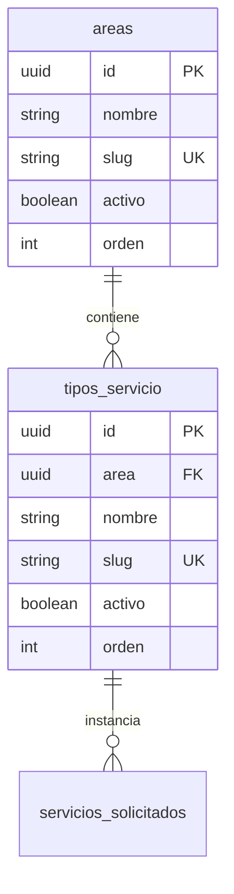

# 03 - Catálogo de Servicios Actual y Distinción Conceptual

> **Estado:** `[WEWEB-VERIFICADO]` / `[CONFIG-VERIFICADO]`  
> **Proyecto WeWeb ID:** `5791a02a-c0b8-49dc-a5b6-afe5fbb53b60`  
> **Fecha de Auditoría:** 2026-09-10

---

## 1. Distinción Conceptual de Términos

Para evitar ambigüedades en la arquitectura y documentación, se establecen las siguientes definiciones precisas:

1. **Área del Solicitante:** El organismo público, Ministerio o Secretaría de procedencia que emite la solicitud (ej: *"Secretaría de Cultura"*, *"Ministerio de Educación"*). Se almacena como texto en `pedidos.area_solicitante`.
2. **Área del Pedido / Categoría:** El departamento interno de la Secretaría de Medios encargado de la producción (`diseno_grafico`, `cobertura_eventos`, `gacetilla`, `redes_sociales`). Se normaliza en la tabla `areas`.
3. **Tipo de Servicio:** El servicio catalogado específico solicitado (`flyer_rrss`, `invitacion_digital`, `certificado`, `otros_diseno`, `cobertura_eventos`, `gacetilla`, `redes_sociales`). Se normaliza en la tabla `tipos_servicio`.
4. **Pieza:** Denominación utilizada en el frontend para referirse a las distintas opciones gráficas solicitables dentro del área de Diseño Gráfico.



---

## 2. Matriz Completa del Catálogo de Servicios

| Área del Pedido (Slug) | Nombre de Área | Tipo de Servicio (Slug) | Nombre del Servicio | Requiere Info Específica | Permite Adjuntos | Evidencia |
|---|---|---|---|---|---|---|
| `diseno_grafico` | Diseño gráfico | `flyer_rrss` | Flyer para Redes Sociales | Sí (Formato, copy, fecha límite) | Sí | `[CONFIG-VERIFICADO]` |
| `diseno_grafico` | Diseño gráfico | `invitacion_digital` | Invitación Digital | Sí (Evento, fecha, lugar, programa) | Sí | `[CONFIG-VERIFICADO]` |
| `diseno_grafico` | Diseño gráfico | `certificado` | Certificados | Sí (Capacitación, firmantes, lista) | Sí | `[CONFIG-VERIFICADO]` |
| `diseno_grafico` | Diseño gráfico | `otros_diseno` | Otros Requerimientos Gráficos | Sí (Descripción libre, medidas) | Sí | `[CONFIG-VERIFICADO]` |
| `cobertura_eventos` | Cobertura de eventos | `cobertura_eventos` | Cobertura Integral de Eventos | Sí (Fecha, horario, lugar, autoridades) | No (Solo en confirmación) | `[CONFIG-VERIFICADO]` |
| `gacetilla` | Gacetilla | `gacetilla` | Redacción de Gacetilla de Prensa | Sí (Contacto prensa, teléfono, info base) | Sí | `[CONFIG-VERIFICADO]` |
| `redes_sociales` | Redes sociales | `redes_sociales` | Publicación en Redes Oficiales | Sí (Fecha sugerida, copy, links) | Sí | `[CONFIG-VERIFICADO]` |

---

## 3. Esquemas JSON de `informacion_especifica` (Sanitizados)

Los datos dinámicos de cada servicio se persisten en la columna `informacion_especifica` (`JSONB`) de `servicios_solicitados`:

### 3.1 `flyer_rrss`
```json
{
  "formato": "1:1",
  "texto_flyer": "Texto principal para pieza digital institucional",
  "fecha_limite": "2026-09-30",
  "observaciones": "Paleta institucional estándar"
}
```

### 3.2 `invitacion_digital`
```json
{
  "nombre_evento": "Jornada Provincial de Capacitación",
  "fecha_evento": "2026-10-05",
  "hora_evento": "10:00",
  "lugar_evento": "Auditorio Central",
  "modalidad": "presencial",
  "programa": "Apertura, paneles y cierre"
}
```

### 3.3 `certificado`
```json
{
  "nombre_capacitacion": "Taller de Comunicación Pública",
  "firmantes": "Autoridades Institucionales",
  "cantidad_destinatarios": 50,
  "formato_entrega": "digital_individual"
}
```

### 3.4 `otros_diseno`
```json
{
  "descripcion_pieza": "Banner informativo para стенд",
  "medidas_soporte": "190cm x 90cm",
  "referencias_visuales": "Manual de marca vigente"
}
```

### 3.5 `cobertura_eventos`
```json
{
  "fecha_evento": "2026-09-28",
  "hora_inicio": "09:00",
  "hora_fin": "13:00",
  "lugar": "Centro Cultural Provincial",
  "ciudad": "Ushuaia",
  "autoridades": "Gabinete Provincial",
  "servicios_requeridos": ["fotografia", "video"]
}
```

### 3.6 `gacetilla`
```json
{
  "contacto_nombre": "Referente de Prensa",
  "contacto_telefono": "+54 9 2901 00-0000",
  "datos_noticia": "Lanzamiento de programa provincial...",
  "ejes_discurso": "Puntos clave y objetivos"
}
```

### 3.7 `redes_sociales`
```json
{
  "fecha_publicacion": "2026-09-29",
  "redes_objetivo": ["instagram", "facebook"],
  "copy_propuesto": "Convocatoria abierta para inscripciones...",
  "enlaces": ["https://tierradelfuego.gob.ar/convocatoria"]
}
```

---

## 4. Evidencia de Verificación
- `[CONFIG-VERIFICADO]`: Tablas `areas`, `tipos_servicio` y JSON schemas extraídos directamente del backend SQL de WeWeb.
