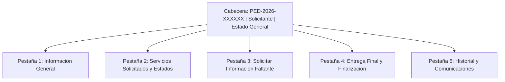

# 05 - Detalle de Pedido y Operaciones de Gestión

> **Estado:** `[WEWEB-VERIFICADO]` / `[CONFIG-VERIFICADO]`  
> **Proyecto WeWeb ID:** `5791a02a-c0b8-49dc-a5b6-afe5fbb53b60`  
> **Fecha de Auditoría:** 2026-09-10  
> **Ruta:** `/pedido/:id` (UID: `48ba972e-d09f-4318-971c-3220fe4ae4ef`)

---

## 1. Estructura y Navegación de la Vista Detalle

Al ingresar a `/pedido/:id`:
1. Extrae el parámetro `:id` (UUID del pedido).
2. Ejecuta el backend workflow `api_obtener_detalle_pedido` (`a3bd5a7e-ca28-4e89-8d14-1cb8ff8fef1c`). `[CONFIG-VERIFICADO]`
3. Renderiza la cabecera y 5 pestañas temáticas: `[WEWEB-VERIFICADO]`

---

## 2. Pestaña 1 — Información General `[WEWEB-VERIFICADO]`
- **Datos del Solicitante:** Nombre completo, correo de contacto, teléfono, organismo emisor.
- **Trazabilidad:** Fecha y hora de creación (`createdAt`), Submission Token, enlace público de seguimiento.
- **Sincronización Notion:** Estado del sync (`notion_sync_status`), URL de página en Notion, timestamp del último sync.

---

## 3. Pestaña 2 — Gestión de Servicios Solicitados `[WEWEB-VERIFICADO]`
Cada servicio solicitado se gestiona mediante controles individuales:
1. **Asignación de Responsable:** Dropdown con `nombre_usuario`, ejecuta `api_asignar_responsable_servicio` (`76b9f273-0aa7-4b71-9252-09292b234473`).
2. **Cambio de Estado del Servicio:**
   - Valores: `Nuevo`, `En revisión`, `Asignado`, `En proceso`, `Esperando información`, `Correcciones`, `Finalizado`, `Cancelado`.
   - Si se selecciona `Cancelado`: Modal que exige el campo obligatorio `motivo_cancelacion`.
   - Ejecuta `api_actualizar_servicio` (`fa8c6c59-efd5-45cf-a734-758fae4d7705`).
3. **Observaciones Internas:** Campo de texto confidencial para notas del equipo (`observaciones_internas`).

---

## 4. Pestaña 3 — Solicitar Información Faltante ([CONTRADICCIÓN RESUELTA])

### 4.1 Comportamiento y Regla de Negocio `[CONFIG-VERIFICADO]`
- **UI:** Área de texto con la leyenda: *"Solicitá la información necesaria sin cambiar el estado del servicio."*
- **Backend Workflow:** `api_solicitar_informacion` (`44ad1bdd-c7e8-45a7-9555-ed11931b30c7`).
- **Lógica de Ejecución Verificada:**
  1. Genera un token aleatorio y calcula su hash SHA-256 (`token_hash`).
  2. Inserta una fila en la tabla `solicitudes_informacion` con vigencia de **15 días** (`expires_at = NOW() + INTERVAL '15 days'`) y `estado = 'pendiente'`.
  3. Ejecuta `bw_enviar_comunicacion_pedido` con `tipo = 'informacion_faltante'` para enviar el email con el enlace a `/solicitud-informacion?token=...`.
  4. **RESOLUCIÓN TÉCNICA:** Ni el SQL ni el workflow modifican `pedidos.estado_general` ni `servicios_solicitados.estado`. El estado del servicio permanece inalterado.

---

## 5. Pestaña 4 — Entrega Final y Finalización `[CONFIG-VERIFICADO]`

Para finalizar un servicio:
1. **Enlace al Producto Final (`producto_final_url`):** Obligatorio (URL HTTPS válida).
2. **Nota de Entrega (`producto_final_nota`):** Comentarios de entrega para el solicitante.
3. **Ejecución Backend:** Invoca `api_actualizar_entrega_final` (`1a00a1fa-1f4a-436f-8012-ba781d4a0ea2`), actualizando `servicios_solicitados.estado = 'Finalizado'` y despachando notificación por email.

---

## 6. Pestaña 5 — Historial y Comunicaciones `[WEWEB-VERIFICADO]`
- Auditoría cronológica de todos los correos e interacciones registradas en `comunicaciones_pedido` para el pedido.

---

## 7. Evidencia de Verificación
- `[WEWEB-VERIFICADO]`: Inspección de componentes de la página `48ba972e-d09f-4318-971c-3220fe4ae4ef`.
- `[CONFIG-VERIFICADO]`: SQL y triggers de `api_obtener_detalle_pedido` y `api_solicitar_informacion`.
