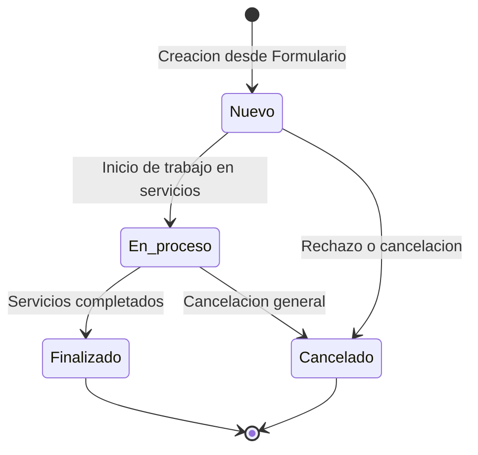
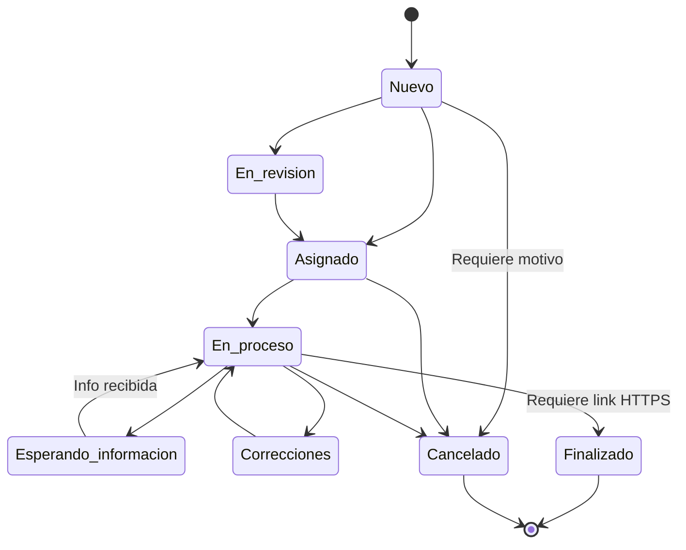

# 06 - Máquinas de Estado y Ciclos de Vida

> **Estado:** `[WEWEB-VERIFICADO]` / `[CONFIG-VERIFICADO]`  
> **Proyecto WeWeb ID:** `5791a02a-c0b8-49dc-a5b6-afe5fbb53b60`  
> **Fecha de Auditoría:** 2026-09-10

---

## 1. Ciclo de Vida del Pedido General (`pedidos.estado_general`)

El estado general sintetiza la condición macro de la solicitud completa. `[CONFIG-VERIFICADO]`

| Estado | Descripción | Transición Inicial | Transiciones Posteriores |
|---|---|---|---|
| `Nuevo` | Solicitud recién ingresada por el solicitante. | Valor por defecto en INSERT. | Pasa a `En proceso`, `Finalizado` o `Cancelado`. |
| `En proceso` | Al menos uno de sus servicios asociados comenzó a trabajarse. | Trigger manual o actualización de servicio. | Pasa a `Finalizado` o `Cancelado`. |
| `Finalizado` | Todos los servicios solicitados han sido completados y entregados. | Cuando todos los servicios pasan a `Finalizado`. | Terminal. |
| `Cancelado` | La solicitud completa fue desestimada o anulada. | Acción manual con motivo explícito. | Terminal. |

---

## 2. Ciclo de Vida de los Servicios (`servicios_solicitados.estado`)

Cada servicio individual dentro de un pedido posee su propio estado operativo. `[CONFIG-VERIFICADO]`

### 2.1 Estados Válidos
1. `Nuevo` (Estado inicial por defecto).
2. `En revisión` (Evaluación de recursos y factibilidad).
3. `Asignado` (Operador responsable designado).
4. `En proceso` (Trabajo en ejecución).
5. `Esperando información` (Requerimiento de aclaración o insumos enviado al solicitante).
6. `Correcciones` (Ajustes solicitados tras revisión interna).
7. `Finalizado` (Entregado; requiere link HTTPS en `producto_final_url`).
8. `Cancelado` (Anulado; requiere texto en `motivo_cancelacion`).

---

## 3. Ciclo de Solicitudes de Información (`solicitudes_informacion.estado`)

| Estado | Evento Desencadenante | Duración / Expiración | Evidencia |
|---|---|---|---|
| `pendiente` | Creado por operador desde `/pedido/:id` (`api_solicitar_informacion`). | Válido por **15 días** (`expires_at = now() + 15 days`). | `[CONFIG-VERIFICADO]` |
| `respondida` | El solicitante envía la respuesta desde `/solicitud-informacion` (`api_responder_solicitud_informacion`). | Terminal. Registra `responded_at` y `respuesta_texto`. | `[CONFIG-VERIFICADO]` |
| `vencida` | Se supera la fecha límite sin recibir respuesta. | Terminal (evaluado en backend por timestamp). | `[CONFIG-VERIFICADO]` |

---

## 4. Ciclo de Acceso de Usuarios (`usuarios_acceso.estado_acceso`)

| Estado | Descripción | Permisos en la App | Evidencia |
|---|---|---|---|
| `pendiente` | Usuario registrado en `/solicitar-acceso`. Espera aprobación de Administrador. | Sin acceso a `/gestion` ni `/pedido/:id`. | `[CONFIG-VERIFICADO]` |
| `aprobado` | Aprobado por Administrador desde `/usuarios`. Se asigna rol (`equipo_interno` o `admin`). | Acceso completo a `/gestion` y `/pedido/:id`. | `[CONFIG-VERIFICADO]` |
| `revocado` | Acceso revocado o suspendido por Administrador. | Bloqueado por los guards de WeWeb. | `[CONFIG-VERIFICADO]` |

---

## 5. Evidencia de Verificación
- `[CONFIG-VERIFICADO]`: Constraints, default values y checks validados en el schema DDL de WeWeb Tables.
