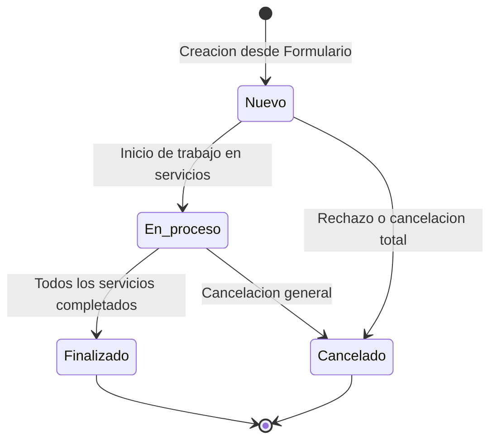
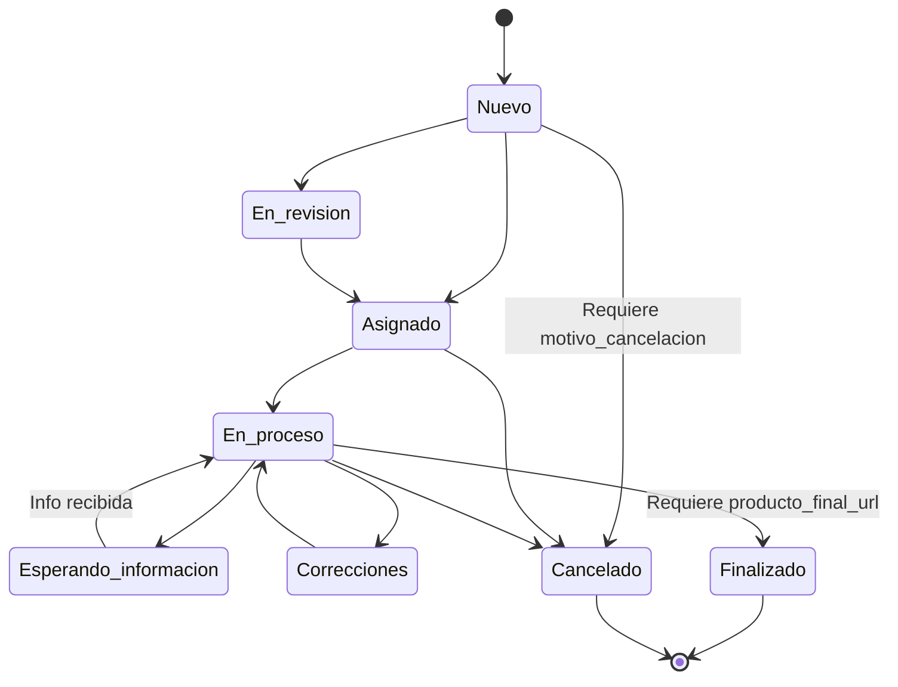

# 06 - Máquinas de Estado y Ciclos de Vida

> **Estado:** `[WEWEB-VERIFICADO]` / `[CONFIG-VERIFICADO]`  
> **Proyecto WeWeb ID:** `5791a02a-c0b8-49dc-a5b6-afe5fbb53b60`  
> **Fecha de Auditoría:** 2026-09-10

---

## 1. Ciclo de Vida de los Pedidos (`pedidos.estado_general`)

El estado general del pedido sintetiza la condición global de la solicitud.

### 1.1 Estados Posibles
| Estado | Descripción | Transición Inicial | Transiciones Posteriores |
|---|---|---|---|
| `Nuevo` | Pedido recién ingresado por el solicitante. | Valor por defecto en INSERT. | Pasa a `En proceso`, `Finalizado` o `Cancelado`. |
| `En proceso` | Al menos uno de sus servicios asociados está siendo trabajado. | Trigger manual o por actualización de servicio. | Pasa a `Finalizado` o `Cancelado`. |
| `Finalizado` | Todos los servicios solicitados han sido completados y entregados. | Cuando todos los servicios pasan a `Finalizado`. | Terminal (solo reabrible por admin). |
| `Cancelado` | El pedido completo fue anulado o desestimado. | Acción de cancelación manual con motivo. | Terminal. |

---

## 2. Ciclo de Vida de los Servicios (`servicios_solicitados.estado`)

Cada servicio individual dentro de un pedido posee su propia máquina de estados finita.

### 2.1 Estados Válidos
1. `Nuevo` (Estado por defecto al crearse).
2. `En revisión` (El equipo está evaluando viabilidad y recursos).
3. `Asignado` (Se ha designado un operador responsable).
4. `En proceso` (El operador está ejecutando el trabajo de diseño, cobertura o redacción).
5. `Esperando información` (Se requiere aclaración o insumos del solicitante).
6. `Correcciones` (Revisión interna o ajustes solicitados).
7. `Finalizado` (Trabajo concluido; requiere link HTTPS a producto final).
8. `Cancelado` (Servicio anulado; requiere motivo de cancelación obligatorio).

---

## 3. Ciclo de Solicitudes de Información (`solicitudes_informacion.estado`)

| Estado | Evento Desencadenante | Duración / Expiración |
|---|---|---|
| `pendiente` | Creado por operador desde `/pedido/:id` (`api_solicitar_informacion`). | Válido por **15 días** (`expires_at = now() + 15 days`). |
| `respondida` | El solicitante envía la respuesta desde `/solicitud-informacion` (`api_responder_solicitud_informacion`). | Terminal. Registra `responded_at` y `respuesta_texto`. |
| `vencida` | Se supera la fecha límite sin recibir respuesta. | Terminal (evaluado en backend por timestamp). |

---

## 4. Ciclo de Acceso de Usuarios (`usuarios_acceso.estado_acceso`)

| Estado | Descripción | Permisos en la App |
|---|---|---|
| `pendiente` | Usuario se registró en `/solicitar-acceso`. Espera aprobación de Administrador. | Solo puede ver pantalla de espera. Sin acceso a `/gestion`. |
| `aprobado` | Aprobado por Administrador desde `/usuarios`. Se le asigna rol WeWeb Auth (`equipo_interno` o `admin`). | Acceso completo a `/gestion` y `/pedido/:id`. |
| `revocado` | Acceso revocado o suspendido por Administrador. | Bloqueado por los guards de WeWeb. |

---

## 5. Evidencia de Verificación
- `[CONFIG-VERIFICADO]`: Constraints, default values y checks validados en el schema de WeWeb Tables y queries SQL.
