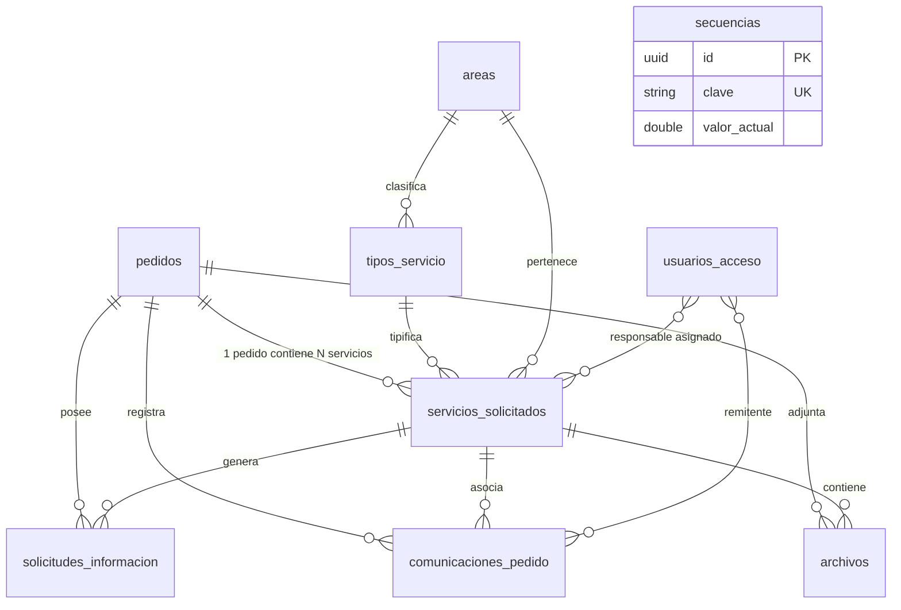

# 07 - Modelo de Datos Actual y Esquema Físico (PostgreSQL)

> **Estado:** `[WEWEB-VERIFICADO]` / `[CONFIG-VERIFICADO]`  
> **Proyecto WeWeb ID:** `5791a02a-c0b8-49dc-a5b6-afe5fbb53b60`  
> **Fecha de Auditoría:** 2026-09-10

---

## 1. Inventario de Tablas en WeWeb Tables

El sistema opera sobre **10 tablas relacionales** en PostgreSQL: `[CONFIG-VERIFICADO]`

| # | Nombre de Tabla | Cantidad Columnas | Clave Primaria (PK) | Función / Entidad |
|---|---|---|---|---|
| 1 | `pedidos` | 15 | `id` (uuid) | Cabecera de la solicitud, solicitante y trazabilidad. |
| 2 | `servicios_solicitados` | 13 | `id` (uuid) | Líneas de servicio asociadas a cada pedido. |
| 3 | `solicitudes_informacion` | 10 | `id` (uuid) | Requerimientos de información complementaria con token hash. |
| 4 | `comunicaciones_pedido` | 12 | `id` (uuid) | Auditoría de correos y webhooks despachados. |
| 5 | `archivos` | 10 | `id` (uuid) | Metadatos y rutas de almacenamiento en Private Storage. |
| 6 | `secuencias` | 4 | `id` (uuid) | Contador atómico para numeración `PED-YYYY-XXXXXX`. |
| 7 | `usuarios_acceso` | 11 | `id` (uuid) | Perfiles de operadores internos y estado de aprobación. |
| 8 | `areas` | 7 | `id` (uuid) | Catálogo de áreas de producción de la Secretaría. |
| 9 | `tipos_servicio` | 8 | `id` (uuid) | Catálogo de tipos de servicios catalogados. |
| 10 | `configuracion` | 5 | `id` (uuid) | Parámetros globales del sistema. |

---

## 2. Diagrama Entidad-Relación y Regla del PED

### 2.1 Demostración de la Regla del PED: `[CONFIG-VERIFICADO]`
- **Dónde reside el PED:** El campo `pedido_visible` (ej: `PED-2026-000101`) reside **exclusivamente en la tabla `pedidos`**.
- **Generación:** Se genera atómicamente consultando la tabla `secuencias` (`clave = 'pedidos_YYYY'`).
- **Relación con Servicios:** Una sumisión en el formulario crea **1 fila en `pedidos`** (con 1 número de PED) y **N filas en `servicios_solicitados`** vinculadas por la clave foránea `pedido = pedidos.id`.
- **Aclaración frente a documentación histórica:** No existe un PED independiente por cada servicio; el PED identifica la solicitud general contenedora.

---

## 3. Esquemas de Columnas y DDL Detallado

### 3.1 Tabla `pedidos` `[CONFIG-VERIFICADO]`
- `id` (uuid, PK, default `gen_random_uuid()`)
- `createdAt` (timestamptz, default `now()`)
- `updatedAt` (timestamptz, default `now()`)
- `pedido_visible` (text, UNIQUE, formato `PED-YYYY-XXXXXX`)
- `numero` (double precision)
- `estado_general` (text, default `'Nuevo'`)
- `nombre_apellido` (text, NOT NULL)
- `telefono` (text, NOT NULL)
- `correo` (text, NOT NULL)
- `area_solicitante` (text, NOT NULL)
- `tipos_pedido` (jsonb, array de slugs de áreas)
- `submission_token` (text, UNIQUE)
- `notion_page_id` (text, nullable)
- `notion_url` (text, nullable)
- `notion_sync_status` (text, default `'pending'`)
- `notion_last_sync_at` (timestamptz, nullable)

### 3.2 Tabla `servicios_solicitados` `[CONFIG-VERIFICADO]`
- `id` (uuid, PK)
- `createdAt` (timestamptz, default `now()`)
- `updatedAt` (timestamptz, default `now()`)
- `pedido` (uuid, FK -> `pedidos.id`)
- `area` (uuid, FK -> `areas.id`)
- `tipo_servicio` (uuid, FK -> `tipos_servicio.id`)
- `estado` (text, default `'Nuevo'`)
- `responsable` (uuid, nullable, FK -> `auth.users.id`)
- `informacion_especifica` (jsonb)
- `observaciones_internas` (text, nullable)
- `producto_final_url` (text, nullable)
- `producto_final_nota` (text, nullable)
- `motivo_cancelacion` (text, nullable)

### 3.3 Tabla `solicitudes_informacion` `[CONFIG-VERIFICADO]`
- `id` (uuid, PK)
- `createdAt` (timestamptz, default `now()`)
- `updatedAt` (timestamptz, default `now()`)
- `pedido` (uuid, FK -> `pedidos.id`)
- `servicio` (uuid, FK -> `servicios_solicitados.id`, nullable)
- `mensaje_solicitado` (text, NOT NULL)
- `token_hash` (text, UNIQUE, SHA-256)
- `estado` (text, default `'pendiente'`)
- `expires_at` (timestamptz, NOT NULL)
- `responded_at` (timestamptz, nullable)
- `respuesta_texto` (text, nullable)

### 3.4 Tabla `comunicaciones_pedido` `[CONFIG-VERIFICADO]`
- `id` (uuid, PK)
- `createdAt` (timestamptz, default `now()`)
- `pedido` (uuid, FK -> `pedidos.id`)
- `servicio` (uuid, nullable)
- `tipo` (text, NOT NULL)
- `estado` (text, NOT NULL, `'enviado'` / `'fallido'`)
- `destinatario` (text, NOT NULL)
- `asunto` (text, NOT NULL)
- `mensaje` (text, NOT NULL)
- `provider_message_id` (text, nullable)
- `error` (text, nullable)
- `enviado_at` (timestamptz, default `now()`)
- `enviado_por` (uuid, nullable)
- `resultado` (text, nullable)

### 3.5 Tabla `archivos` `[CONFIG-VERIFICADO]`
- `id` (uuid, PK)
- `createdAt` (timestamptz, default `now()`)
- `categoria` (text, NOT NULL)
- `nombre_original` (text, NOT NULL)
- `mime_type` (text, NOT NULL)
- `size_bytes` (double precision, NOT NULL)
- `storage_path` (text, NOT NULL)
- `servicio` (uuid, nullable)
- `solicitud_informacion` (uuid, nullable)
- `subido_por` (text, nullable)
- `archivo` (text, nullable)

### 3.6 Tabla `secuencias` `[CONFIG-VERIFICADO]`
- `id` (uuid, PK)
- `clave` (text, UNIQUE, ej: `'pedidos_2026'`)
- `valor_actual` (double precision, default 0)
- `updatedAt` (timestamptz, default `now()`)

### 3.7 Tabla `usuarios_acceso` `[CONFIG-VERIFICADO]`
- `id` (uuid, PK)
- `createdAt` (timestamptz, default `now()`)
- `updatedAt` (timestamptz, default `now()`)
- `usuario` (uuid, UNIQUE, FK -> `auth.users.id`)
- `nombre` (text, nullable)
- `apellido` (text, nullable)
- `nombre_usuario` (text, UNIQUE, nullable, min 2 max 30 chars, lowercase)
- `nombre_apellido` (text, nullable, campo legado)
- `estado_acceso` (text, default `'pendiente'`)
- `solicitado_at` (timestamptz, default `now()`)
- `aprobado_at` (timestamptz, nullable)
- `aprobado_por` (uuid, nullable)

---

## 4. Evidencia de Verificación
- `[CONFIG-VERIFICADO]`: DDL y columnas extraídos directamente de WeWeb Tables metadata.
