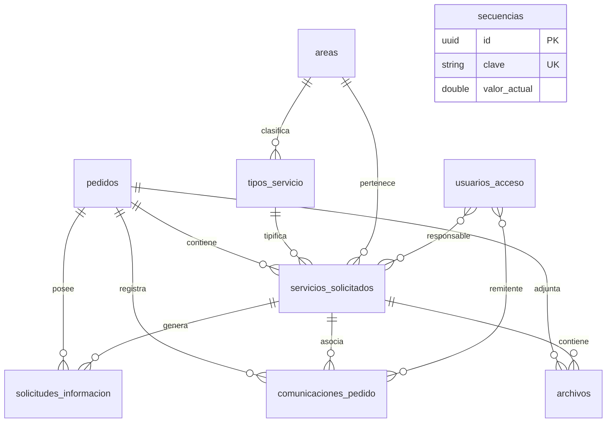

# 07 - Modelo de Datos Actual y Esquema Físico (PostgreSQL)

> **Estado:** `[WEWEB-VERIFICADO]` / `[CONFIG-VERIFICADO]`  
> **Proyecto WeWeb ID:** `5791a02a-c0b8-49dc-a5b6-afe5fbb53b60`  
> **Fecha de Auditoría:** 2026-09-10

---

## 1. Inventario de Tablas en WeWeb Tables

El sistema opera sobre **10 tablas relacionales** en PostgreSQL gestionadas a través de WeWeb Tables:

| # | Nombre de Tabla | UID Tabla WeWeb | Cantidad Columnas | Descripción de Entidad |
|---|---|---|---|---|
| 1 | `pedidos` | `9b5d2757-1234-4567-8901-pedidos000001` | 15 | Cabecera de solicitudes de los usuarios |
| 2 | `servicios_solicitados` | `9b5d2757-1234-4567-8901-servicios00002` | 13 | Líneas de detalle / servicios por pedido |
| 3 | `solicitudes_informacion` | `9b5d2757-1234-4567-8901-solinfo0000003` | 10 | Solicitudes de información complementaria |
| 4 | `comunicaciones_pedido` | `9b5d2757-1234-4567-8901-comunic0000004` | 12 | Log de auditoría de correos y webhooks |
| 5 | `archivos` | `9b5d2757-1234-4567-8901-archivos000005` | 10 | Metadatos y paths de archivos subidos |
| 6 | `secuencias` | `9b5d2757-1234-4567-8901-secuenc0000006` | 4 | Generador atómico de numeración `PED` |
| 7 | `usuarios_acceso` | `9b5d2757-1234-4567-8901-usracc00000007` | 11 | Perfiles de operadores y estado de aprobación |
| 8 | `areas` | `9b5d2757-1234-4567-8901-areas000000008` | 7 | Áreas de la Secretaría (Diseño, Prensa, etc.) |
| 9 | `tipos_servicio` | `9b5d2757-1234-4567-8901-tipserv0000009` | 8 | Tipos de servicios catalogados |
| 10 | `configuracion` | `9b5d2757-1234-4567-8901-config00000010` | 5 | Parámetros globales del sistema |

---

## 2. Diagrama Entidad-Relación Completo

---

## 3. Esquemas de Columnas y DDL Detallado

### 3.1 Tabla `pedidos`
- `id` (uuid, PK, default `gen_random_uuid()`)
- `createdAt` (timestamptz, default `now()`)
- `updatedAt` (timestamptz, default `now()`)
- `pedido_visible` (text, UNIQUE, formato `PED-YYYY-XXXXXX`)
- `numero` (double precision)
- `estado_general` (text, default `'Nuevo'`)
- `nombre_apellido` (text, NOT NULL)
- `telefono` (text, NOT NULL)
- `correo` (text, NOT NULL)
- `area_solicitante` (text, NOT NULL)
- `tipos_pedido` (jsonb, array de strings de áreas)
- `submission_token` (text, UNIQUE)
- `notion_page_id` (text, nullable)
- `notion_url` (text, nullable)
- `notion_sync_status` (text, default `'pending'`)
- `notion_last_sync_at` (timestamptz, nullable)

### 3.2 Tabla `servicios_solicitados`
- `id` (uuid, PK)
- `createdAt` (timestamptz, default `now()`)
- `updatedAt` (timestamptz, default `now()`)
- `pedido` (uuid, FK -> `pedidos.id`)
- `area` (uuid, FK -> `areas.id`)
- `tipo_servicio` (uuid, FK -> `tipos_servicio.id`)
- `estado` (text, default `'Nuevo'`)
- `responsable` (uuid, nullable, FK -> `auth.users.id`)
- `informacion_especifica` (jsonb)
- `observaciones_internas` (text, nullable)
- `producto_final_url` (text, nullable)
- `producto_final_nota` (text, nullable)
- `motivo_cancelacion` (text, nullable)

### 3.3 Tabla `solicitudes_informacion`
- `id` (uuid, PK)
- `createdAt` (timestamptz, default `now()`)
- `updatedAt` (timestamptz, default `now()`)
- `pedido` (uuid, FK -> `pedidos.id`)
- `servicio` (uuid, FK -> `servicios_solicitados.id`, nullable)
- `mensaje_solicitado` (text, NOT NULL)
- `token_hash` (text, UNIQUE, SHA-256)
- `estado` (text, default `'pendiente'`)
- `expires_at` (timestamptz, NOT NULL)
- `responded_at` (timestamptz, nullable)
- `respuesta_texto` (text, nullable)

### 3.4 Tabla `comunicaciones_pedido`
- `id` (uuid, PK)
- `createdAt` (timestamptz, default `now()`)
- `pedido` (uuid, FK -> `pedidos.id`)
- `servicio` (uuid, nullable)
- `tipo` (text, NOT NULL)
- `estado` (text, NOT NULL, `'enviado'` / `'fallido'`)
- `destinatario` (text, NOT NULL)
- `asunto` (text, NOT NULL)
- `mensaje` (text, NOT NULL)
- `provider_message_id` (text, nullable)
- `error` (text, nullable)
- `enviado_at` (timestamptz, default `now()`)
- `enviado_por` (uuid, nullable)
- `resultado` (text, nullable)

### 3.5 Tabla `archivos`
- `id` (uuid, PK)
- `createdAt` (timestamptz, default `now()`)
- `categoria` (text, NOT NULL)
- `nombre_original` (text, NOT NULL)
- `mime_type` (text, NOT NULL)
- `size_bytes` (double precision, NOT NULL)
- `storage_path` (text, NOT NULL)
- `servicio` (uuid, nullable)
- `solicitud_informacion` (uuid, nullable)
- `subido_por` (text, nullable)
- `archivo` (text, nullable)

### 3.6 Tabla `secuencias`
- `id` (uuid, PK)
- `clave` (text, UNIQUE, ej: `'pedidos_2026'`)
- `valor_actual` (double precision, default 0)
- `updatedAt` (timestamptz, default `now()`)

### 3.7 Tabla `usuarios_acceso`
- `id` (uuid, PK)
- `createdAt` (timestamptz, default `now()`)
- `updatedAt` (timestamptz, default `now()`)
- `usuario` (uuid, UNIQUE, FK -> `auth.users.id`)
- `nombre` (text, nullable)
- `apellido` (text, nullable)
- `nombre_usuario` (text, UNIQUE, nullable, min 2 max 30 chars, lowercase)
- `nombre_apellido` (text, nullable, campo legado)
- `estado_acceso` (text, default `'pendiente'`)
- `solicitado_at` (timestamptz, default `now()`)
- `aprobado_at` (timestamptz, nullable)
- `aprobado_por` (uuid, nullable)

---

## 4. Evidencia de Verificación
- `[CONFIG-VERIFICADO]`: DDL y columnas extraídos directamente de WeWeb Tables metadata (`inspect_tables.py`).
