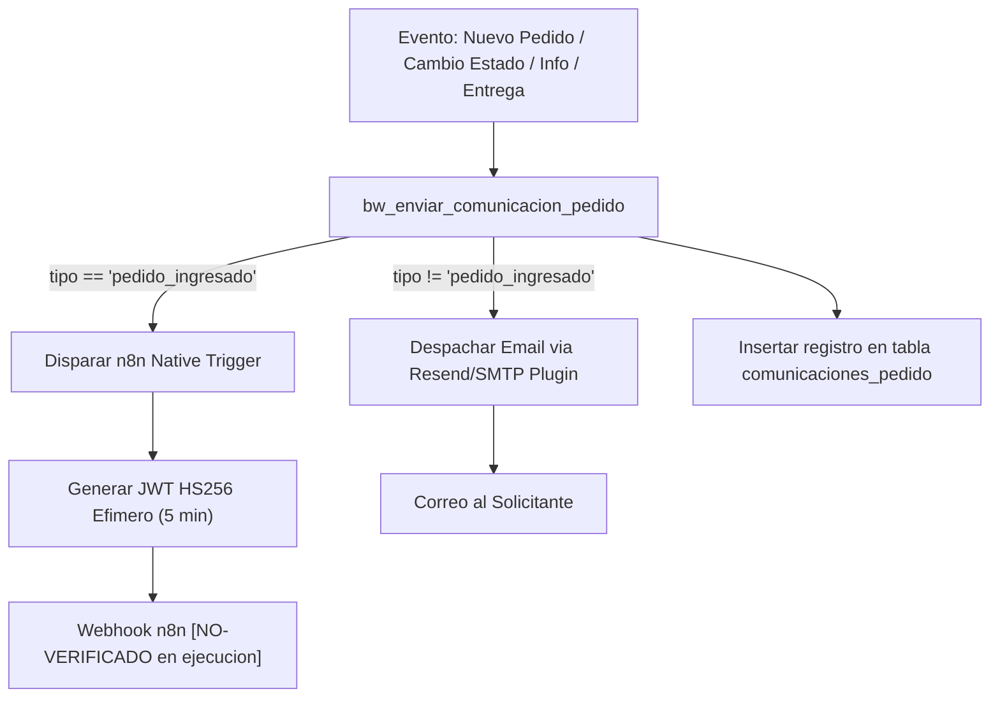

# 12 - Comunicaciones, n8n y Notificaciones por Correo

> **Estado:** `[WEWEB-VERIFICADO]` / `[CONFIG-VERIFICADO]`  
> **Proyecto WeWeb ID:** `5791a02a-c0b8-49dc-a5b6-afe5fbb53b60`  
> **Fecha de Auditoría:** 2026-09-10

---

## 1. Arquitectura de Comunicaciones

El sistema centraliza todas las comunicaciones en el backend workflow `bw_enviar_comunicacion_pedido` (`8e32cb71-f921-470a-a712-4091a679efb5`): `[CONFIG-VERIFICADO]`



---

## 2. Integración con n8n (`pedido_ingresado`)

Para el ingreso de nuevos pedidos, WeWeb dispara la integración nativa de n8n:
- **Variable de Secreto:** `N8N_PEDIDOS_JWT_SECRET_V2` (Environment Variable). `[CONFIG-VERIFICADO]`
- **Token JWT:** `[CONFIG-VERIFICADO]`
  - Algoritmo: `HS256`.
  - Expiración: 5 minutos (`exp = now() + 300`).
  - Payload sanitizado:
    ```json
    {
      "communication_id": "uuid-v7",
      "pedido_id": "uuid-pedido",
      "pedido_visible": "PED-2026-XXXXXX",
      "tipo": "pedido_ingresado",
      "jti": "nonce-criptografico"
    }
    ```
- **Webhook Target:** Configurado en la variable `N8N_WEBHOOK_URL_PEDIDOS`.
- **Estado de Auditoría:** `[CONFIG-VERIFICADO]` en WeWeb; `[NO-VERIFICADO]` en cuanto a la lógica interna y ejecución final dentro del servidor de n8n.

---

## 3. Plantillas de Correo Transaccional (Resend / SMTP Plugin)

Para los eventos posteriores al ingreso inicial, WeWeb utiliza el plugin de email transaccional (`Resend / SMTP`): `[CONFIG-VERIFICADO]`

1. **`informacion_faltante`:**
   - Asunto: `Información requerida para su solicitud {{pedido_visible}}`
   - Contenido: Detalle del requerimiento solicitado por el operador y botón CTA hacia `/solicitud-informacion?token={{token}}`.
2. **`cambio_estado`:**
   - Asunto: `Actualización de estado en su pedido {{pedido_visible}}`
   - Contenido: Notificación del nuevo estado del servicio y enlace a `/seguimiento`.
3. **`finalizado`:**
   - Asunto: `Su solicitud {{pedido_visible}} ha sido finalizada`
   - Contenido: Enlace directo de descarga (`producto_final_url`) y notas de entrega del operador.
4. **`cancelado`:**
   - Asunto: `Cancelación de servicio en pedido {{pedido_visible}}`
   - Contenido: Motivo detallado de la cancelación.

---

## 4. Auditoría en Base de Datos (`comunicaciones_pedido`)
Cada intento de envío registra de forma inmediata:
- `pedido`, `servicio`, `tipo`, `destinatario`, `asunto`, `mensaje`, `estado` (`enviado` o `fallido`), `provider_message_id` y `error` en caso de falla. `[CONFIG-VERIFICADO]`

---

## 5. Evidencia de Verificación
- `[CONFIG-VERIFICADO]`: Código JavaScript y SQL de `bw_enviar_comunicacion_pedido` extraído de los volcados de workflows.
