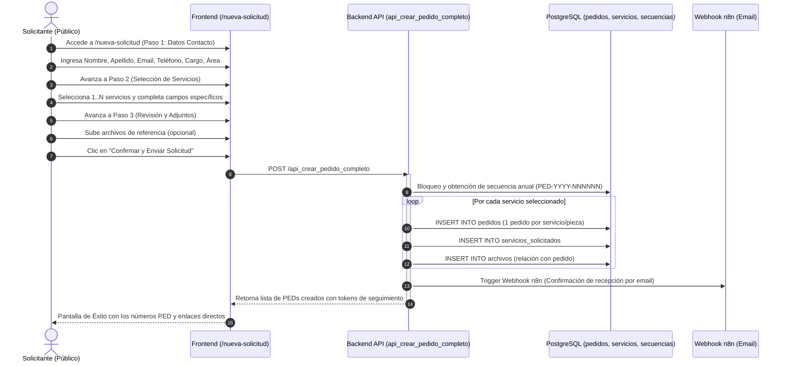
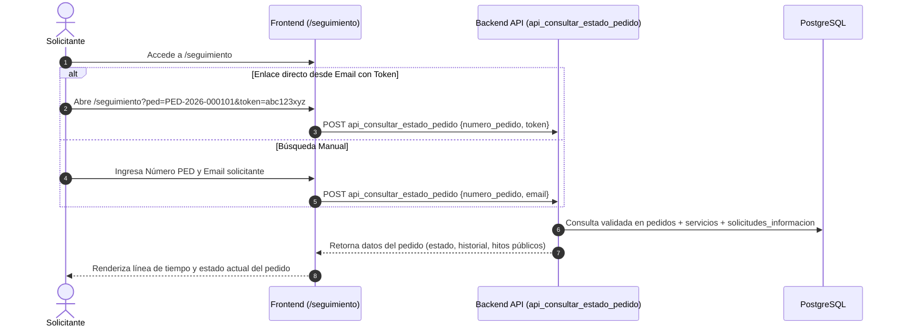
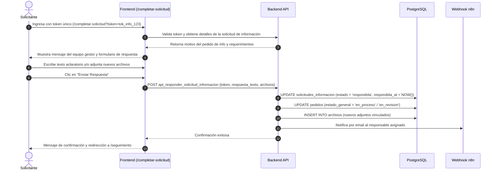
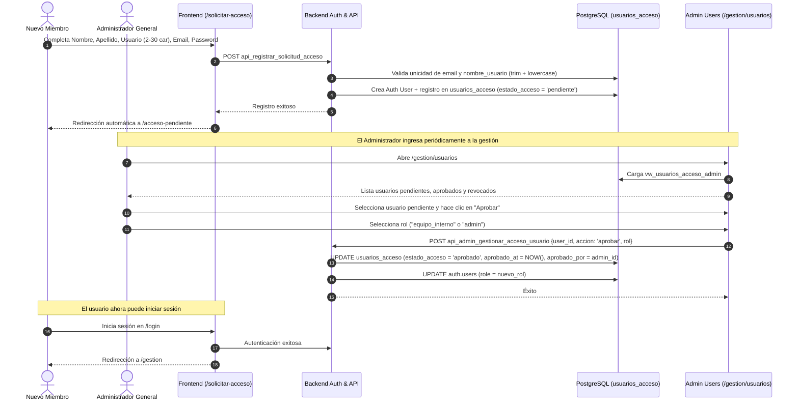
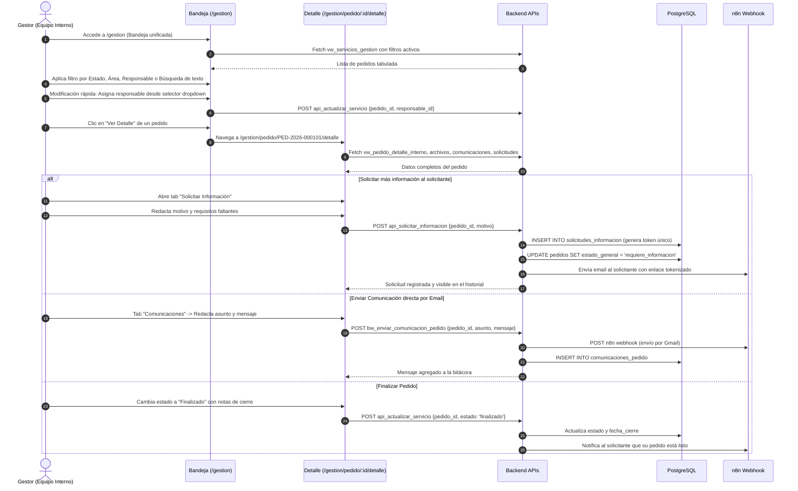

# 01. Recorridos de Usuario (User Journeys)

Este documento describe la totalidad de los flujos de interacción de los distintos perfiles de usuario dentro del sistema **PEDIDOS — Secretaría de Medios**, detallando precondiciones, pasos, decisiones del sistema, llamadas a la API, efectos colaterales y manejo de excepciones.

---

## 1. Perfiles de Usuario y Modelo de Actores

| Perfil | Nivel de Privilegio | Modo de Acceso | Finalidad Principal |
| :--- | :--- | :--- | :--- |
| **Solicitante Público** | Anónimo / Ciudadano / Organismo | Acceso público sin login previo | Crear solicitudes de servicios de medios, consultar seguimiento de pedidos y responder pedidos de aclaración/archivos. |
| **Postulante a Equipo** | Registrado en espera | Cuenta Auth (`estado_acceso = 'pendiente'`) | Registro de cuenta corporativa solicitando ingreso al equipo interno de gestión. |
| **Equipo Interno (Gestor)** | Autenticado | Rol `equipo_interno`, `estado_acceso = 'aprobado'` | Visualizar bandeja unificada de pedidos, filtrar, reasignar responsables, actualizar estados, solicitar más datos y comunicarse por email. |
| **Administrador General** | Autenticado y Superusuario | Rol `admin`, `estado_acceso = 'aprobado'` | Control total operativo + administración de accesos, roles, revocaciones y normalización de identidades (`nombre_usuario`). |

---

## 2. Recorrido 1: Solicitud de Servicios (Solicitante Público)

### Diagrama de Secuencia

### Descripción Detallada del Recorrido:
1. **Entrada y Navegación**:
   - URL: `/nueva-solicitud`.
   - El formulario se presenta como un wizard progresivo de 3 pasos con persistencia reactiva en variables locales.
2. **Paso 1 — Identificación y Datos de Contacto**:
   - Campos requeridos: `Nombre`, `Apellido`, `Email institucional`, `Teléfono de contacto`, `Cargo/Función`, `Área u Organismo solicitante` (select dinámico alimentado por `vw_areas_activas`).
   - Validaciones: Email válido mediante regex, teléfono mínimo 6 dígitos, área seleccionada obligatoria.
   - Acción: Botón "Siguiente" valida el formulario; si es válido, avanza a Paso 2.
3. **Paso 2 — Selección y Parametrización de Servicios**:
   - Se muestra un catálogo de servicios activos (`vw_tipos_servicio_activos`) categorizados (ej. Cobertura Fotográfica, Gacetilla de Prensa, Diseño Gráfico, Audiovisual, Campañas).
   - El usuario selecciona uno o varios servicios mediante checkbox / toggle cards.
   - Cada servicio seleccionado expande su propio bloque de campos requeridos (ej. Fecha y hora del evento, locación, dimensiones solicitadas, formato de entrega, público objetivo, etc.).
4. **Paso 3 — Archivos Adjuntos y Revisión Consolidada**:
   - El solicitante puede adjuntar 1 a N archivos de apoyo (documentos, manuales de marca, borradores, fotos de referencia).
   - Los archivos se suben al almacenamiento seguro (WeWeb Storage privado).
   - Se presenta un resumen general de datos de contacto y detalle de cada servicio configurado.
   - El usuario marca la confirmación de veracidad y hace clic en **"Confirmar y Enviar Solicitud"**.
5. **Lógica de Creación Atómica (Regla de Oro: 1 Servicio = 1 PED)**:
   - El backend workflow `api_crear_pedido_completo` recibe el payload con el array de servicios.
   - Para **cada servicio** se genera un número único consecutivo basado en la secuencia anual `PED-YYYY-NNNNNN` (ej. `PED-2026-000101`, `PED-2026-000102`).
   - Se crea un registro en `pedidos` (con `estado_general = 'pendiente'`), un registro en `servicios_solicitados`, y se asocian los registros en `archivos`.
   - Se genera un token criptográfico `token_acceso` (UUID v4 / hash 64 chars) por cada pedido para acceso público seguro.
   - Se dispara un webhook a n8n para enviar un correo unificado de confirmación al solicitante con la lista de códigos PED y sus enlaces directos.
6. **Pantalla de Finalización y Confirmación**:
   - Se limpian las variables del wizard.
   - Se despliega una vista de éxito con las tarjetas de cada PED generado, botón de copiar enlace al portapapeles y enlace para descargar comprobante o volver a la home.

---

## 3. Recorrido 2: Consulta Pública de Estado y Seguimiento

### Comportamiento Operativo:
- **Validación de Identidad**: Para proteger la privacidad institucional, la consulta requiere coincidencia exacta de (`numero_pedido` + `token_acceso`) o (`numero_pedido` + `solicitante_email`).
- **Visualización**:
  - Badge de estado general (`Pendiente`, `En Proceso`, `Requiere Información`, `Finalizado`, `Cancelado`).
  - Hitos temporales (Fecha de ingreso, fecha de inicio de producción, fecha de entrega estimada).
  - Alerta especial si el pedido está en `requiere_informacion`: se resalta un banner con botón de acción directa hacia `/completar-solicitud?token=...`.

---

## 4. Recorrido 3: Aclaración y Entrega de Información (/completar-solicitud)

---

## 5. Recorrido 4: Registro y Aprobación de Usuario Interno

---

## 6. Recorrido 5: Gestión Integral de Pedidos (Equipo Interno)

---

## 7. Recorrido 6: Gestión de Usuarios y Seguridad (Administrador)

1. **Navegación**: El administrador hace clic en "Usuarios" en la barra superior o ingresa a `/gestion/usuarios`.
2. **Listado y Filtros**:
   - Pestañas de estado: `Pendientes de Aprobación`, `Activos / Aprobados`, `Revocados / Inactivos`.
3. **Acciones Disponibles**:
   - **Aprobar Solicitud**: Asigna rol operativo (`equipo_interno`) o administrativo (`admin`), activa la cuenta en `usuarios_acceso`.
   - **Rechazar / Revocar**: Cambia `estado_acceso` a `revocado` e invalida sesiones activas.
   - **Editar Identidad (`nombre_usuario`)**:
     - Modal de edición rápida del alias de sistema.
     - Valida en vivo: min 2, max 30 caracteres, sin espacios intermedios raros, normalizado a minúsculas (`trim + lowercase`).
     - Ejecuta `api_admin_editar_nombre_usuario` verificando unicidad contra la base de datos.
