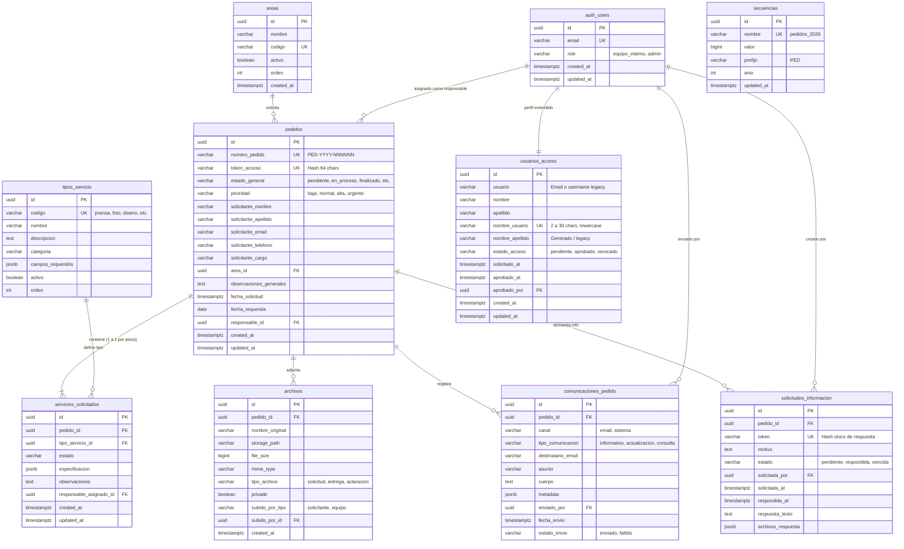

# 04. Modelo de Datos Relacional y Vistas SQL

Este documento especifica el modelo relacional completo de la base de datos PostgreSQL de WeWeb Tables, documentando las 10 tablas, sus claves primarias, foráneas, índices, restricciones y las 9 vistas SQL de consulta.

---

## 1. Diagrama Entidad-Relación (ERD)



---

## 2. Definición Detallada de Tablas (DDL PostgreSQL)

```sql
-- 1. Tabla: secuencias (Generador atómico de numeración PED)
CREATE TABLE IF NOT EXISTS secuencias (
    id UUID PRIMARY KEY DEFAULT gen_random_uuid(),
    nombre VARCHAR(50) NOT NULL UNIQUE,
    valor BIGINT NOT NULL DEFAULT 0,
    prefijo VARCHAR(20) NOT NULL DEFAULT 'PED',
    anio INT NOT NULL,
    updated_at TIMESTAMPTZ NOT NULL DEFAULT NOW()
);

-- 2. Tabla: areas
CREATE TABLE IF NOT EXISTS areas (
    id UUID PRIMARY KEY DEFAULT gen_random_uuid(),
    nombre VARCHAR(100) NOT NULL,
    codigo VARCHAR(50) NOT NULL UNIQUE,
    activo BOOLEAN NOT NULL DEFAULT TRUE,
    orden INT NOT NULL DEFAULT 0,
    created_at TIMESTAMPTZ NOT NULL DEFAULT NOW()
);

-- 3. Tabla: tipos_servicio
CREATE TABLE IF NOT EXISTS tipos_servicio (
    id UUID PRIMARY KEY DEFAULT gen_random_uuid(),
    codigo VARCHAR(50) NOT NULL UNIQUE,
    nombre VARCHAR(100) NOT NULL,
    descripcion TEXT,
    categoria VARCHAR(50) NOT NULL DEFAULT 'comunicacion',
    campos_requeridos JSONB DEFAULT '{}'::jsonb,
    activo BOOLEAN NOT NULL DEFAULT TRUE,
    orden INT NOT NULL DEFAULT 0
);

-- 4. Tabla: usuarios_acceso (Perfil extendido de Auth)
CREATE TABLE IF NOT EXISTS usuarios_acceso (
    id UUID PRIMARY KEY, -- Coincide 1 a 1 con auth.users.id
    usuario VARCHAR(100),
    nombre VARCHAR(100),
    apellido VARCHAR(100),
    nombre_usuario VARCHAR(30) UNIQUE,
    nombre_apellido VARCHAR(200),
    estado_acceso VARCHAR(50) NOT NULL DEFAULT 'pendiente', -- pendiente, aprobado, revocado
    solicitado_at TIMESTAMPTZ NOT NULL DEFAULT NOW(),
    aprobado_at TIMESTAMPTZ,
    aprobado_por UUID,
    created_at TIMESTAMPTZ NOT NULL DEFAULT NOW(),
    updated_at TIMESTAMPTZ NOT NULL DEFAULT NOW()
);

-- 5. Tabla: pedidos
CREATE TABLE IF NOT EXISTS pedidos (
    id UUID PRIMARY KEY DEFAULT gen_random_uuid(),
    numero_pedido VARCHAR(50) NOT NULL UNIQUE, -- 'PED-2026-000101'
    token_acceso VARCHAR(64) NOT NULL UNIQUE,
    estado_general VARCHAR(50) NOT NULL DEFAULT 'pendiente',
    prioridad VARCHAR(20) NOT NULL DEFAULT 'normal',
    solicitante_nombre VARCHAR(100) NOT NULL,
    solicitante_apellido VARCHAR(100) NOT NULL,
    solicitante_email VARCHAR(150) NOT NULL,
    solicitante_telefono VARCHAR(50) NOT NULL,
    solicitante_cargo VARCHAR(100),
    area_id UUID NOT NULL REFERENCES areas(id),
    observaciones_generales TEXT,
    fecha_solicitud TIMESTAMPTZ NOT NULL DEFAULT NOW(),
    fecha_requerida DATE,
    responsable_id UUID, -- Referencia a auth.users.id
    created_at TIMESTAMPTZ NOT NULL DEFAULT NOW(),
    updated_at TIMESTAMPTZ NOT NULL DEFAULT NOW()
);

-- 6. Tabla: servicios_solicitados
CREATE TABLE IF NOT EXISTS servicios_solicitados (
    id UUID PRIMARY KEY DEFAULT gen_random_uuid(),
    pedido_id UUID NOT NULL REFERENCES pedidos(id) ON DELETE CASCADE,
    tipo_servicio_id UUID NOT NULL REFERENCES tipos_servicio(id),
    estado VARCHAR(50) NOT NULL DEFAULT 'pendiente',
    especificacion JSONB NOT NULL DEFAULT '{}'::jsonb,
    observaciones TEXT,
    responsable_asignado_id UUID,
    created_at TIMESTAMPTZ NOT NULL DEFAULT NOW(),
    updated_at TIMESTAMPTZ NOT NULL DEFAULT NOW()
);

-- 7. Tabla: archivos
CREATE TABLE IF NOT EXISTS archivos (
    id UUID PRIMARY KEY DEFAULT gen_random_uuid(),
    pedido_id UUID NOT NULL REFERENCES pedidos(id) ON DELETE CASCADE,
    nombre_original VARCHAR(255) NOT NULL,
    storage_path VARCHAR(500) NOT NULL,
    file_size BIGINT NOT NULL DEFAULT 0,
    mime_type VARCHAR(100) NOT NULL,
    tipo_archivo VARCHAR(50) NOT NULL DEFAULT 'solicitud', -- solicitud, entrega, aclaracion
    privado BOOLEAN NOT NULL DEFAULT TRUE,
    subido_por_tipo VARCHAR(20) NOT NULL DEFAULT 'solicitante', -- solicitante, equipo
    subido_por_id UUID,
    created_at TIMESTAMPTZ NOT NULL DEFAULT NOW()
);

-- 8. Tabla: comunicaciones_pedido
CREATE TABLE IF NOT EXISTS comunicaciones_pedido (
    id UUID PRIMARY KEY DEFAULT gen_random_uuid(),
    pedido_id UUID NOT NULL REFERENCES pedidos(id) ON DELETE CASCADE,
    canal VARCHAR(50) NOT NULL DEFAULT 'email',
    tipo_comunicacion VARCHAR(50) NOT NULL DEFAULT 'informativo',
    destinatario_email VARCHAR(150) NOT NULL,
    asunto VARCHAR(255) NOT NULL,
    cuerpo TEXT NOT NULL,
    metadata JSONB DEFAULT '{}'::jsonb,
    enviado_por UUID,
    fecha_envio TIMESTAMPTZ NOT NULL DEFAULT NOW(),
    estado_envio VARCHAR(50) NOT NULL DEFAULT 'enviado'
);

-- 9. Tabla: solicitudes_informacion
CREATE TABLE IF NOT EXISTS solicitudes_informacion (
    id UUID PRIMARY KEY DEFAULT gen_random_uuid(),
    pedido_id UUID NOT NULL REFERENCES pedidos(id) ON DELETE CASCADE,
    token VARCHAR(64) NOT NULL UNIQUE,
    motivo TEXT NOT NULL,
    estado VARCHAR(50) NOT NULL DEFAULT 'pendiente', -- pendiente, respondida, vencida
    solicitada_por UUID,
    solicitada_at TIMESTAMPTZ NOT NULL DEFAULT NOW(),
    respondida_at TIMESTAMPTZ,
    respuesta_texto TEXT,
    archivos_respuesta JSONB DEFAULT '[]'::jsonb
);
```

---

## 3. Catálogo de Vistas SQL de la Plataforma

### 1. `vw_servicios_gestion` (Vista principal de la Bandeja de Gestión)
```sql
CREATE OR REPLACE VIEW vw_servicios_gestion AS
SELECT 
    p.id AS pedido_id,
    p.numero_pedido,
    p.fecha_solicitud,
    p.fecha_requerida,
    p.estado_general,
    p.prioridad,
    p.solicitante_nombre || ' ' || p.solicitante_apellido AS solicitante_nombre_completo,
    p.solicitante_email,
    p.solicitante_telefono,
    a.nombre AS area_nombre,
    ts.nombre AS tipo_servicio_nombre,
    ts.codigo AS tipo_servicio_codigo,
    ss.id AS servicio_solicitado_id,
    ss.estado AS servicio_estado,
    p.responsable_id,
    COALESCE(NULLIF(BTRIM(ua.nombre_usuario), ''), 'sin_usuario') AS responsable_nombre_usuario
FROM pedidos p
JOIN servicios_solicitados ss ON ss.pedido_id = p.id
JOIN tipos_servicio ts ON ts.id = ss.tipo_servicio_id
JOIN areas a ON a.id = p.area_id
LEFT JOIN usuarios_acceso ua ON ua.id = p.responsable_id;
```

### 2. `vw_pedido_detalle_interno`
Devuelve la agregación completa de un pedido para la pantalla `/gestion/pedido/:pedidoid/detalle`, incluyendo datos del solicitante, área, especificación técnica del servicio y métricas de tiempo transcurrido.

### 3. `vw_usuarios_acceso_admin`
```sql
CREATE OR REPLACE VIEW vw_usuarios_acceso_admin AS
SELECT 
    ua.id,
    ua.usuario,
    ua.nombre,
    ua.apellido,
    ua.nombre_usuario,
    ua.nombre_apellido,
    ua.estado_acceso,
    ua.solicitado_at,
    ua.aprobado_at,
    ua.aprobado_por,
    au.email,
    au.role AS auth_role
FROM usuarios_acceso ua
LEFT JOIN auth.users au ON au.id = ua.id;
```

### 4. `vw_mi_acceso`
Permite a cualquier usuario autenticado consultar su propio estado de acceso y rol validado (`WHERE id = auth.uid()`).

### 5. `vw_areas_activas` y `vw_tipos_servicio_activos`
Vistas públicas optimizadas con filtro `WHERE activo = TRUE ORDER BY orden ASC` para nutrir los selectores del wizard `/nueva-solicitud`.
