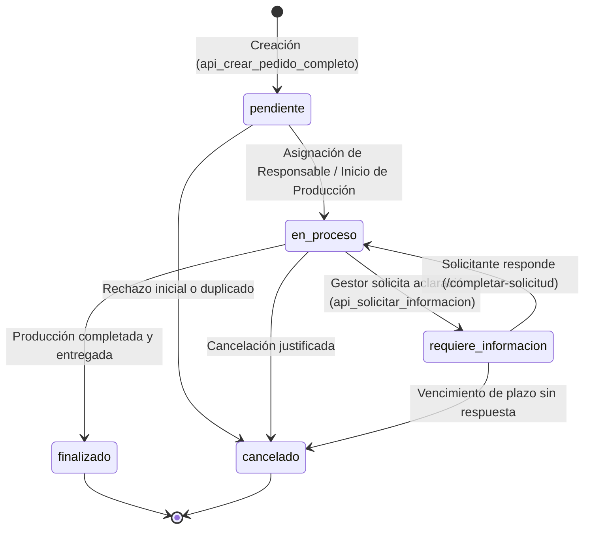
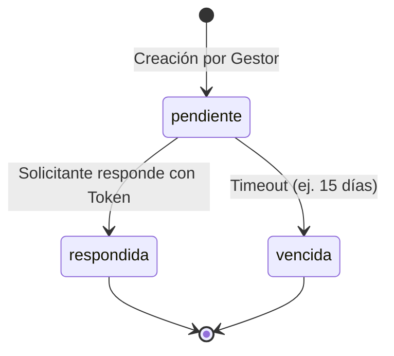
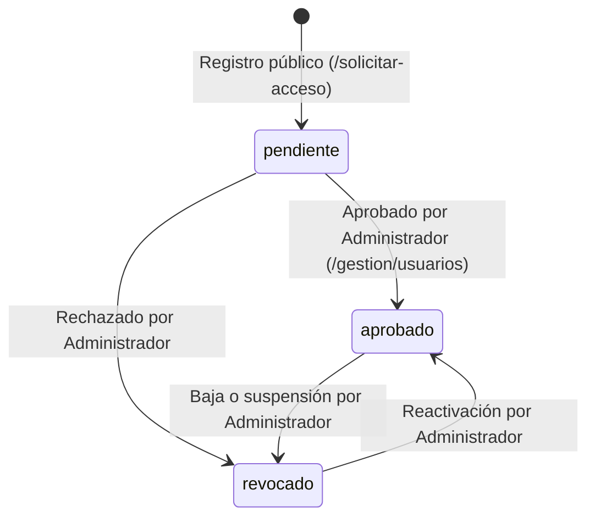

# 08. Máquinas de Estado y Ciclos de Vida

Este documento formaliza las máquinas de estado finitas (FSM) que rigen las entidades del sistema: Pedidos, Servicios, Solicitudes de Información y Accesos de Usuario.

---

## 1. Ciclo de Vida del Pedido General (`pedidos.estado_general`)

### Tabla de Transiciones del Pedido:

| Estado Origen | Evento / Acción | Estado Destino | Actor Habilitado | Efecto Colateral |
| :--- | :--- | :--- | :--- | :--- |
| `[*] (Ninguno)` | `SUBMIT_FORM` | `pendiente` | Solicitante | Asigna número PED, token y envía correo de confirmación. |
| `pendiente` | `ASSIGN_RESPONSIBLE` | `en_proceso` | Gestor / Admin | Actualiza `responsable_id`, actualiza fecha de inicio. |
| `en_proceso` | `REQUEST_INFO` | `requiere_informacion` | Gestor / Admin | Genera token info, notifica al solicitante por email. |
| `requiere_informacion` | `SUBMIT_INFO` | `en_proceso` | Solicitante (Público) | Guarda respuesta, adjunta archivos, notifica al gestor. |
| `en_proceso` | `COMPLETE_ORDER` | `finalizado` | Gestor / Admin | Registra fecha de finalización, envía notificación de entrega. |
| `pendiente` / `en_proceso` | `CANCEL_ORDER` | `cancelado` | Gestor / Admin | Registra motivo de cancelación en observaciones. |

---

## 2. Ciclo de Vida de Solicitud de Información (`solicitudes_informacion.estado`)

---

## 3. Ciclo de Vida del Acceso de Usuario (`usuarios_acceso.estado_acceso`)

