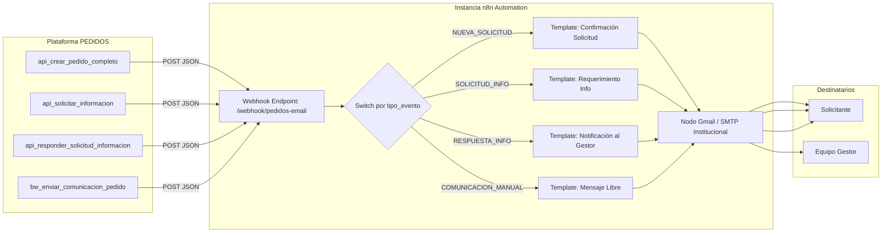

# 09. Integración con n8n, Correos y Notificaciones

Este documento especifica la integración entre la plataforma de pedidos y el motor de automatización n8n, detallando webhooks, formatos de payload, plantillas de correo y bitácora de comunicaciones.

---

## 1. Arquitectura de Notificaciones



---

## 2. Especificación de Payloads de Webhook

### Endpoint: `<N8N_WEBHOOK_URL>` (ej. `https://n8n.pablosaldiviafotos.ar/webhook/pedidos-email`)
- **Método**: `POST`
- **Headers**: `Content-Type: application/json`, `X-Webhook-Secret: <SECRET_TOKEN>`

### 2.1. Evento: `NUEVA_SOLICITUD`
```json
{
  "evento": "NUEVA_SOLICITUD",
  "fecha_emision": "2026-09-09T18:00:00Z",
  "solicitante": {
    "nombre": "María",
    "apellido": "González",
    "email": "mgonzalez@organismo.gob.ar",
    "cargo": "Directora de Comunicación",
    "area": "Ministerio de Salud"
  },
  "pedidos": [
    {
      "numero_pedido": "PED-2026-000101",
      "servicio": "Cobertura Fotográfica",
      "token_acceso": "9f8e7d6c-5b4a-3210-fedc-ba9876543210",
      "url_seguimiento": "https://pedidos.medios.gob.ar/seguimiento?ped=PED-2026-000101&token=9f8e7d6c-5b4a-3210-fedc-ba9876543210"
    },
    {
      "numero_pedido": "PED-2026-000102",
      "servicio": "Gacetilla de Prensa",
      "token_acceso": "1a2b3c4d-5e6f-7890-abcd-ef0123456789",
      "url_seguimiento": "https://pedidos.medios.gob.ar/seguimiento?ped=PED-2026-000102&token=1a2b3c4d-5e6f-7890-abcd-ef0123456789"
    }
  ]
}
```

### 2.2. Evento: `SOLICITUD_INFORMACION`
```json
{
  "evento": "SOLICITUD_INFORMACION",
  "numero_pedido": "PED-2026-000101",
  "servicio": "Diseño Gráfico",
  "solicitante_email": "mgonzalez@organismo.gob.ar",
  "solicitante_nombre": "María González",
  "motivo": "Necesitamos que nos envíes el logo institucional en formato vectorial (.AI o .SVG) y confirmes las medidas exactas del banner.",
  "token_respuesta": "tok_req_abcdef123456",
  "url_respuesta": "https://pedidos.medios.gob.ar/completar-solicitud?token=tok_req_abcdef123456"
}
```

### 2.3. Evento: `COMUNICACION_MANUAL`
```json
{
  "evento": "COMUNICACION_MANUAL",
  "numero_pedido": "PED-2026-000101",
  "destinatario_email": "mgonzalez@organismo.gob.ar",
  "destinatario_nombre": "María González",
  "asunto": "Actualización sobre la cobertura del acto del 15 de Septiembre",
  "cuerpo": "Estimada María, te confirmamos que el fotógrafo asignado estará presente 30 minutos antes del inicio.",
  "enviado_por": "psaldivia"
}
```

---

## 3. Bitácora de Auditoría en Base de Datos

Cada mensaje despachado se persiste inmediatamente en la tabla `comunicaciones_pedido`:
- `canal`: `'email'`
- `tipo_comunicacion`: `'informativo'` | `'solicitud_info'` | `'actualizacion'`
- `estado_envio`: `'enviado'` (o `'fallido'` con retry)
- `metadata`: JSON con el payload exacto enviado al webhook.
