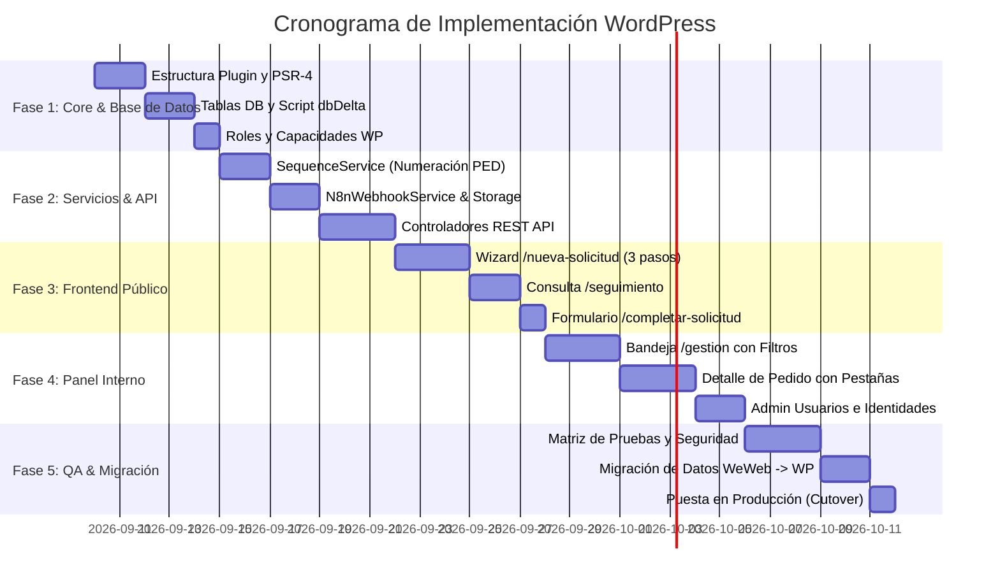

# 16. Plan de Implementación Paso a Paso en WordPress

Este documento establece la hoja de ruta cronológica en 5 fases para que un desarrollador experto en WordPress construya, pruebe y despliegue el reemplazo funcional de WeWeb.

---

## 1. Cronograma de Fases

---

## 2. Detalle de Fases de Ejecución

### Fase 1: Core, Base de Datos y Permisos
- Crear el plugin `pedidos-medios`.
- Ejecutar el script `Schema::create_tables()` para inicializar las 8 tablas relacionales.
- Crear los roles de WordPress:
  - `gestor_pedidos` (Capacidad: `gestionar_pedidos`).
  - `admin_pedidos` (Capacidades: `gestionar_pedidos`, `administrar_pedidos`).
- Poblar tablas base (`wp_pedidos_areas`, `wp_pedidos_tipos_servicio`, `wp_pedidos_secuencias`).

### Fase 2: Servicios de Negocio y REST API
- Implementar `SequenceService` con soporte de transacciones atómicas `SELECT ... FOR UPDATE`.
- Implementar `N8nWebhookService` con timeout, firmas de seguridad y retry.
- Implementar `StorageService` para subida y descarga protegida de archivos.
- Registrar las 16 rutas REST API en `/wp-json/pedidos/v1/`.

### Fase 3: Interfaces Públicas
- Desarrollar la plantilla `/nueva-solicitud` con el Wizard reactivo de 3 pasos.
- Desarrollar la pantalla `/seguimiento` con soporte de query params `?ped=...&token=...`.
- Desarrollar la pantalla `/completar-solicitud` con validación de token de solicitud de información.

### Fase 4: Consola de Gestión Interna
- Desarrollar la Bandeja `/gestion` con tabla dinámica, filtros en vivo y cambio rápido de responsable.
- Desarrollar `/gestion/pedido/:id/detalle` con pestañas de Info, Archivos, Solicitar Información y Comunicaciones por Email.
- Desarrollar `/gestion/usuarios` con aprobación, revocación y edición de `nombre_usuario` (2 a 30 caracteres).

### Fase 5: QA, Migración de Datos y Switch
- Ejecutar la matriz de pruebas unitarias y de integración (18_MATRIZ_QA.md).
- Exportar registros existentes de WeWeb Tables e importarlos mediante script SQL/PHP.
- Configurar DNS / subdominio oficial y dar de baja el proyecto WeWeb.
